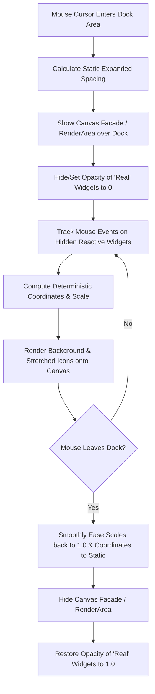

# Production Specification: Deterministic Dock Magnification

This document details the complete design principles, state machines, and mathematical formulations required to build a smooth, high-performance, and **deterministic** macOS-style dock magnification animation. 

A complete, interactive verification implementation is located in the repository at [tests/dock_animation.js](tests/dock_animation.js).

---

## 1. Architectural Flow & Pipeline (The Facade Pattern)

To achieve smooth rendering at high frame rates, we decouple mouse tracking and layout computation from standard UI widget layout cycles. 

During magnification, the system operates in two distinct states:



### 1. Static Layout Spacing
When the mouse is outside the dock, icons are drawn as normal widgets. Upon mouse entry, we increase the base padding of the icon containers, keeping the icon sizes themselves unchanged. This prepares a wider resting dock width ($L$), ensuring that when icons scale, they have room to expand.

### 2. The Canvas Facade (`renderArea`)
Repositioning complex GTK/Clutter widget subtrees on every frame is computationally expensive and causes visual lag. To solve this, we overlay a high-performance custom drawing area (the **Facade**) directly on top of the dock:
* The opacity of the actual interactive GTK widgets is set to `0` (hidden), but they are **kept reactive** to pointer events and hover triggers.
* The `renderArea` canvas intercepts the mouse coordinates and handles the visual rendering of the stretched background and scaled icons.

---

## 2. Core Mathematical Challenges

An elegant dock magnification must satisfy three strict geometric rules:
1. **Perfect Alignment (No Drift)**: When the mouse pointer is directly centered over a resting icon $i$, that icon's magnified center must align exactly under the mouse pointer. It must not drift or slide horizontally.
2. **Stationary Boundaries (Rigid Edges)**:
   * When the mouse is at the far-left edge ($x_m = 0$), the rightmost icon must remain completely stationary.
   * When the mouse is at the far-right edge ($x_m = L$), the leftmost icon must remain completely stationary.
3. **Continuous Smooth Boundaries**: Icons entering or leaving the zone of influence must swell up and scale down smoothly without sudden jumps in position or scale.

---

## 3. The Unified Deterministic Warping Model

Instead of using frame-rate-dependent iterative collision loops (which cause "jitter"), this design maps coordinates in a single $O(N)$ pass using **continuous coordinate warping and localized boundary anchoring**.

### Mathematical Variable Definitions
* $L$: The total expanded resting width of the dock.
* $x_i$: The original static center coordinate of icon $i$ (where $x_i \in [0, L]$).
* $x_m$: The mouse cursor coordinate along the horizontal dock axis ($x_m \in [0, L]$).
* $R$: The **Radius of Influence** (how far horizontally the zoom effect propagates).
* $M$: The **Maximum Scale Factor** (e.g., $2.0$ for $200\%$ magnification).
* $s_i$: The computed scale factor of icon $i$.
* $x'_i$: The final warped center coordinate of icon $i$.

---

### Step 1: The Local Scale Profile $s(u)$
The scale factor for any original coordinate $u$ is determined using a **cubic smoothstep function**. This shape function has a zero derivative ($C^1$ continuous) at both boundaries ($y = \pm 1$), which ensures perfectly smooth transitions:

$$s(u) = \begin{cases} 
1 + (M - 1) \cdot h\left(\frac{|u - x_m|}{R}\right) & \text{if } |u - x_m| < R \\
1.0 & \text{otherwise}
\end{cases}$$

Where the smoothstep shape function $h(y)$ is:
$$h(y) = 1 - 3y^2 + 2y^3$$

```
   Scale s(u)
     M  +         .---.
        |        /     \
        |       /       \
   1.0  +------'         '------
        |
        +------+---------+------>  u
             xm - R     xm     xm + R
```

---

### Step 2: The Continuous Antiderivative $G(u)$
To determine how coordinates should warp (slide apart) to accommodate the magnified space, we integrate the scaling function $s(u)$ to obtain the antiderivative $G(u) = \int s(u) \, du$.

Let $z = \frac{u - x_m}{R}$. The analytical closed-form solution of $G(u)$ is:

$$G(u) = \begin{cases}
u & \text{if } u < x_m - R \\
u + (M - 1) \cdot R \cdot \left[ z - z^3 + \text{sign}(z) \cdot \frac{1}{2} z^4 + 0.5 \right] & \text{if } x_m - R \le u \le x_m + R \\
u + (M - 1) \cdot R & \text{if } u > x_m + R
\end{cases}$$

---

### Step 3: Raw Expansion Displacement $e_i$
We define the raw expansion displacement $e_i(x_m)$ as the unconstrained horizontal shift of coordinate $x_i$ relative to the cursor position:

$$e_i = G(x_i) - G(x_m) - (x_i - x_m)$$

*Note: By definition, if the mouse is directly over the icon's resting center ($x_m = x_i$), then $e_i = 0$.*

---

### Step 4: Localized Anchoring Factor $A_i$
To anchor the boundaries of the dock rigidly (so that the outer edges never move past $0$ and $L$), we scale the raw expansion displacement of each icon by an anchoring coefficient $A_i(x_m)$. 

This factor is $1.0$ at the cursor position and smoothly decays to $0.0$ at the dock boundaries:

$$A_i = \begin{cases}
\frac{L - x_i}{L - x_m} & \text{if } x_i > x_m \quad \text{(Icons to the right of the cursor)} \\
\frac{x_i}{x_m} & \text{if } x_i < x_m \quad \text{(Icons to the left of the cursor)} \\
1.0 & \text{if } x_i = x_m \quad \text{(Icon directly under the cursor)}
\end{cases}$$

---

### Step 5: Spread Influence & Dynamic progressive Scaling
To give icons extra breathing room and control their separation when they expand, we introduce a **Spread Factor**. 

We define a **Base Spread Influence** $S_{\text{base}}$ (e.g., $1.0$) and a **Dynamic Spread Factor** $S_{\text{dynamic}}$ which automatically increases the spread as magnification $M$ and radius $R$ grow larger, keeping the icons from crowding at high scales:

$$S_{\text{dynamic}} = S_{\text{base}} \cdot \left[ 1.0 + \beta \cdot (M - 1.0) \cdot \left(\frac{R}{150.0}\right) \right]$$

Where:
* $S_{\text{base}}$: User-configurable base spread (typically $0.8 - 1.2$).
* $\beta$: Progressive multiplier coefficient (recommended value of $0.12$).
* $\frac{R}{150.0}$: Normalized radius scaling.

---

### Step 6: The Final Warped Coordinate $x'_i$
By scaling the anchored displacement by our dynamic spread influence, we obtain the final horizontal position $x'_i$ for each icon center:

$$x'_i = x_i + A_i \cdot e_i \cdot S_{\text{dynamic}}$$

*Note: Since $e_i = 0$ when $x_m = x_i$ and $A_i = 0$ at the boundaries, adding the spread factor completely preserves both Perfect Alignment and Boundary Anchoring.*

---

## 4. Vertical Rise and Background Panel Stretching

### 1. Vertical Axis Elevation (Y-Offset)
As icons scale up, they rise above the baseline of the dock background to prevent overlapping. The rise elevation $\Delta y_i$ is a direct linear function of the scale factor $s_i$:

$$\Delta y_i = \text{RiseDirection} \cdot \text{RiseHeight} \cdot (s_i - 1.0)$$

Where:
* $\text{RiseDirection} = -1$ (to rise upwards in standard screen-coordinate systems).
* $\text{RiseHeight}$: The maximum upward translation offset (typically $24\text{px} - 32\text{px}$).

### 2. Background Panel Boundaries
The background dock panel must stretch smoothly to wrap around the active magnified icons. Since the warped leftmost ($x'_0$) and rightmost ($x'_{N-1}$) icon centers are computed deterministically, we find the exact bounding box of the active dock background panel in $O(1)$ time:

$$\text{DockLeft} = x'_0 - \frac{s_0 \cdot \text{IconSize}}{2} - \text{Padding}$$

$$\text{DockRight} = x'_{N-1} + \frac{s_{N-1} \cdot \text{IconSize}}{2} + \text{Padding}$$

---

## 5. Reference Implementation

An interactive demonstration script implementing this complete mathematical model is available in the repository at [tests/dock_animation.js](tests/dock_animation.js).

### Running the Verification Suite
Run the test script directly using GJS to see the animation in an interactive GTK 4 canvas window:

```bash
gjs -m tests/dock_animation.js
```

### Key Interactive Controls in the Test Script
* **Mouse Movement**: Glide horizontally across the drawing area to inspect coordinate alignment and edge anchoring.
* **Up / Down Arrow Keys**: Adjust the maximum scale factor $M$ in real time.
* **Left / Right Arrow Keys**: Adjust the radius of influence $R$ in real time.
* **W / S Keys**: Adjust the base spread influence $S_{\text{base}}$ in real time.
* **Faint Outlines**: The script displays the static, unmagnified layout behind the active canvas, allowing you to visually verify that:
  * When the mouse is hovering directly over a faint outline center, the active colored box is centered **precisely** on it.
  * The outer edges remain perfectly fixed to the static dock bounds when the cursor is at the far edges of the screen.
