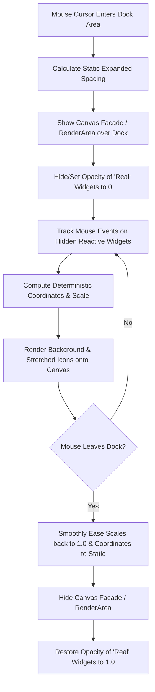

# Production Specification: Deterministic Dock Magnification

This document details the complete design principles, state machines, and mathematical formulations required to build a smooth, high-performance, and **deterministic** macOS-style dock magnification animation. 

A complete, interactive verification implementation is located in the repository at [tests/dock_animation.js](tests/dock_animation.js).

---

## 1. Architectural Flow & Pipeline (The Facade Pattern)

To achieve smooth rendering at high frame rates, we decouple mouse tracking and layout computation from standard UI widget layout cycles. 

During magnification, the system operates in two distinct states:



### 1. Static Layout Spacing
When the mouse is outside the dock, icons are drawn as normal widgets. Upon mouse entry, we increase the base padding of the icon containers, keeping the icon sizes themselves unchanged. This prepares a wider resting dock width ($L$), ensuring that when icons scale, they have room to expand.

### 2. The Canvas Facade (`renderArea`)
Repositioning complex GTK/Clutter widget subtrees on every frame is computationally expensive and causes visual lag. To solve this, we overlay a high-performance custom drawing area (the **Facade**) directly on top of the dock:
* The opacity of the actual interactive GTK widgets is set to `0` (hidden), but they are **kept reactive** to pointer events and hover triggers.
* The `renderArea` canvas intercepts the mouse coordinates and handles the visual rendering of the stretched background and scaled icons.

### 3. Smooth Entry/Exit Easing (Transition Curve)
To prevent sudden popping of scales or positions, the transition of spacing padding and magnification is smoothly eased over time. We introduce a frame-rate-independent transition variable $T_{\text{progress}} \in [0.0, 1.0]$ (implemented via a GTK frame tick callback):
* **Mouse Enters**: $T_{\text{progress}}$ smoothly rises from $0.0$ to $1.0$ (firing up).
* **Mouse Leaves**: $T_{\text{progress}}$ smoothly falls from $1.0$ back to $0.0$ (cooling down).

This transition variable is used to scale and interpolate all active layout properties smoothly during the entrance and exit phases:
* **Animated Spacing Padding**:
  $$\text{Padding}_{\text{animated}} = \text{Padding}_{\text{static}} + (\text{Padding}_{\text{active}} - \text{Padding}_{\text{static}}) \cdot T_{\text{progress}}$$
* **Animated Icon Scale**:
  $$s_{\text{animated}, i} = 1.0 + (s_i - 1.0) \cdot T_{\text{progress}}$$
* **Animated Warped Coordinate**:
  $$x'_{i,\text{animated}} = x_i + A_i \cdot e_i \cdot T_{\text{progress}}$$

---

## 2. Core Mathematical Challenges

An elegant dock magnification must satisfy three strict geometric rules:
1. **Perfect Alignment (No Drift)**: When the mouse pointer is directly centered over a resting icon $i$, that icon's magnified center must align exactly under the mouse pointer. It must not drift or slide horizontally.
2. **Stationary Boundaries (Rigid Edges)**:
   * When the mouse is at the far-left edge ($x_m = 0$), the rightmost icon must remain completely stationary.
   * When the mouse is at the far-right edge ($x_m = L$), the leftmost icon must remain completely stationary.
3. **Continuous Smooth Boundaries**: Icons entering or leaving the zone of influence must swell up and scale down smoothly without sudden jumps in position or scale.

---

## 3. The Unified Deterministic Warping Model

Instead of using frame-rate-dependent iterative collision loops (which cause "jitter"), this design maps coordinates in a single $O(N)$ pass using **continuous coordinate warping and localized boundary anchoring**.

### Mathematical Variable Definitions
* $L$: The total expanded resting width of the dock.
* $x_i$: The original static center coordinate of icon $i$ (where $x_i \in [0, L]$).
* $x_m$: The mouse cursor coordinate along the horizontal dock axis ($x_m \in [0, L]$).
* $R$: The **Radius of Influence** (how far horizontally the zoom effect propagates).
* $M$: The **Maximum Scale Factor** (e.g., $2.0$ for $200\%$ magnification).
* $p$: The **Shape Exponent** ($p \ge 1.0$) which controls the "sharpness" or "pointiness" of the magnification peak.
* $s_i$: The computed scale factor of icon $i$.
* $x'_i$: The final warped center coordinate of icon $i$.

---

### Step 1: The Local Scale Profile $s(u)$
The scale factor for any original coordinate $u$ is determined using a **generalized power shape function**. This function allows us to control the "sharpness" of the zoom peak. 

By varying the exponent $p$, we can morph the transition from a highly-rounded flat-topped profile ($p = 3.0$) to a standard parabola ($p = 2.0$), down to a razor-sharp triangular cusp ($p = 1.0$):

$$s(u) = \begin{cases} 
1 + (M - 1) \cdot h\left(\frac{|u - x_m|}{R}\right) & \text{if } |u - x_m| < R \\
1.0 & \text{otherwise}
\end{cases}$$

Where the generalized shape function $h(y)$ is defined on $[0, 1]$ as:
$$h(y) = 1 - y^p$$

```
   Scale s(u) (Smooth Parabolic Top, p = 2.0)
     M  +         .---.
        |        /     \
        |       /       \
   1.0  +------'         '------
        |
        +------+---------+------>  u
             xm - R     xm     xm + R

   Scale s(u) (Sharp Pointed Cusp, p = 1.0)
     M  +           /\
        |          /  \
        |         /    \
   1.0  +------  '      '  -----
        |
        +------+---------+------>  u
             xm - R     xm     xm + R
```

---

### Step 2: The Continuous Antiderivative $G(u)$
To determine how coordinates should warp (slide apart) to accommodate the magnified space, we integrate our generalized scaling function $s(u)$ to obtain the antiderivative $G(u) = \int s(u) \, du$.

Let $z = \frac{u - x_m}{R}$. The analytical closed-form solution of $G(u)$ for any exponent $p \ge 1.0$ is:

$$G(u) = \begin{cases}
u & \text{if } u < x_m - R \\
u + (M - 1) \cdot R \cdot \left[ z - \text{sign}(z) \cdot \frac{|z|^{p+1}}{p+1} + \frac{p}{p+1} \right] & \text{if } x_m - R \le u \le x_m + R \\
u + 2(M - 1) \cdot R \cdot \frac{p}{p+1} & \text{if } u > x_m + R
\end{cases}$$

*(Notice how setting $p = 1.0$ simplifies the boundary shift to $(M-1)R$, matching a linear triangle, and $p = 2.0$ yields $\frac{4}{3}(M-1)R$, matching a quadratic parabola).*

---

### Step 3: Raw Expansion Displacement $e_i$
We define the raw expansion displacement $e_i(x_m)$ as the unconstrained horizontal shift of coordinate $x_i$ relative to the cursor position:

$$e_i = G(x_i) - G(x_m) - (x_i - x_m)$$

*Note: By definition, if the mouse is directly over the icon's resting center ($x_m = x_i$), then $e_i = 0$.*

---

### Step 4: Localized Anchoring Factor $A_i$
To anchor the boundaries of the dock rigidly (so that the outer edges never move past $0$ and $L$), we scale the raw expansion displacement of each icon by an anchoring coefficient $A_i(x_m)$. 

This factor is $1.0$ at the cursor position and smoothly decays to $0.0$ at the dock boundaries:

$$A_i = \begin{cases}
\frac{L - x_i}{L - x_m} & \text{if } x_i > x_m \quad \text{(Icons to the right of the cursor)} \\
\frac{x_i}{x_m} & \text{if } x_i < x_m \quad \text{(Icons to the left of the cursor)} \\
1.0 & \text{if } x_i = x_m \quad \text{(Icon directly under the cursor)}
\end{cases}$$

---

### Step 5: Spacing Padding (The "Spread")
In this design, the spacing padding between the fixed icon containers **is** the spread. Instead of using an arbitrary horizontal coordinate multiplier, we define a **Base Spacing Padding** $\text{Padding}_{\text{static}}$ (e.g., adjustable via `W/S` keys) that sets the unmagnified expanded distance between icons.

To keep the dock compact when resting, the expanded padding **does not take effect** if the dock is not actively animating. Instead, the resting dock remains closely-packed using a tight default baseline:
$$\text{Padding}_{\text{unanimated}} = 2\text{px}$$

When the mouse enters and the dock is actively animating, the padding smoothly expands ("fires up") from this tight baseline towards the fully-expanded target padding $\text{Padding}_{\text{target}}$ as a function of the transition factor $T_{\text{progress}}$:

$$\text{Padding}_{\text{target}} = \text{Padding}_{\text{static}} \cdot \left[ 1.0 + \beta \cdot (M - 1.0) \cdot \left(\frac{R}{150.0}\right) \right]$$

$$\text{Padding}_{\text{active}} = \text{Padding}_{\text{unanimated}} + (\text{Padding}_{\text{target}} - \text{Padding}_{\text{unanimated}}) \cdot T_{\text{progress}}$$

Where:
* $\text{Padding}_{\text{static}}$: Configured expanded spacing padding (typically $8\text{px} - 24\text{px}$).
* $\text{Padding}_{\text{unanimated}} = 2\text{px}$: Rigid compact default spacing when not animating.
* $\beta$: Progressive multiplier coefficient ($0.12$).
* $\frac{R}{150.0}$: Normalized radius scaling.

The **Active Container Width** and **Active Dock Length** ($L$) are dynamically computed as:
$$\text{ContainerWidth}_{\text{active}} = \text{IconSize} + \text{Padding}_{\text{active}}$$
$$L = N \cdot \text{ContainerWidth}_{\text{active}}$$

The unwarped resting centers $x_i$ of each icon are then pre-calculated on this active coordinate space:
$$x_i = i \cdot \text{ContainerWidth}_{\text{active}} + \frac{\text{ContainerWidth}_{\text{active}}}{2}$$

---

### Step 6: The Final Warped Coordinate $x'_i$
Since the spread spacing is now built directly into the unwarped coordinates $x_i$ and active dock length $L$ (which are used inside $A_i$ and $e_i$), the final warped center $x'_i$ for each icon is mapped with elegant simplicity:

$$x'_i = x_i + A_i \cdot e_i$$

*Note: Since the spacing is baked directly into the baseline coordinate system on each frame, the warping engine naturally distributes the icons with perfect horizontal breathing room while preserving Perfect Alignment ($x'_i = x_i$ when $x_m = x_i$) and Stationary Boundaries ($x'_0 = 0$ and $x'_{N-1} = L$) with absolute mathematical rigor.*

---

## 4. Vertical Rise, Background Stretching, and Peak Sharpness

### 1. Vertical Axis Elevation and Dynamic Pointiness (Rise Influence)
To create an immersive 3D-like zoom effect, as icons approach the mouse cursor, they rise above the dock baseline. We introduce a user-configurable **Rise Influence Factor** $E_{\text{rise}}$ (e.g., via `W/S` keys) that simultaneously links vertical rise and peak pointedness:

#### A. Scaled Elevation Height
$$\Delta y_i = \text{RiseDirection} \cdot \text{RiseHeight} \cdot E_{\text{rise}} \cdot (s_i - 1.0)$$

Where:
* $\text{RiseDirection} = -1$ (upwards in screen coordinates).
* $\text{RiseHeight}$: Base height (typically $55\text{px}$).

#### B. Dynamic Exponent Pointiness
As the icon is pushed higher ($E_{\text{rise}}$ increases), we smoothly morph the shape of the warping parabola to a more **pointed cone peak** by decreasing the shape exponent $p$ towards $1.0$:

$$p = \text{clamp}(2.7 - 1.5 \cdot (E_{\text{rise}} - 0.3), 1.0, 3.0)$$

This elegant coupling ensures that:
* At **Low Rise ($E_{\text{rise}} \approx 0.3$)**, the magnification profile is a flat, highly-rounded dome ($p = 2.7$).
* At **Standard Rise ($E_{\text{rise}} = 1.0$)**, the profile matches a pointed parabola ($p = 1.65$).
* At **High Rise ($E_{\text{rise}} \ge 1.43$)**, the profile collapses completely into a geometric, cusp-like triangular peak ($p = 1.0$), concentrating the zoom visual right under the cursor point.

### 2. Background Panel Boundaries
The background dock panel must stretch smoothly to wrap around the active magnified icons. Since the warped leftmost ($x'_0$) and rightmost ($x'_{N-1}$) icon centers are computed deterministically, we find the exact bounding box of the active dock background panel in $O(1)$ time:

$$\text{DockLeft} = x'_0 - \frac{s_0 \cdot \text{IconSize}}{2} - \text{Padding}$$

$$\text{DockRight} = x'_{N-1} + \frac{s_{N-1} \cdot \text{IconSize}}{2} + \text{Padding}$$

---

## 5. Reference Implementation

An interactive demonstration script implementing this complete mathematical model is available in the repository at [tests/dock_animation.js](tests/dock_animation.js).

### Running the Verification Suite
Run the test script directly using GJS to see the animation in an interactive GTK 4 canvas window:

```bash
gjs -m tests/dock_animation.js
```

### Key Interactive Controls in the Test Script
* **Mouse Movement**: Glide horizontally across the drawing area to inspect coordinate alignment and edge anchoring.
* **Up / Down Arrow Keys**: Adjust the maximum scale factor $M$ in real time.
* **Left / Right Arrow Keys**: Adjust the radius of influence $R$ in real time.
* **A / D Keys**: Adjust the static spacing padding (the baseline spread) in real time.
* **W / S Keys**: Adjust the rise influence $E_{\text{rise}}$ in real time, smoothly morphing the peak pointiness.
* **Faint Outlines**: The script displays the static, unmagnified layout behind the active canvas, allowing you to visually verify that:
  * When the mouse is hovering directly over a faint outline center, the active colored box is centered **precisely** on it.
  * The outer edges remain perfectly fixed to the static dock bounds when the cursor is at the far edges of the screen.
