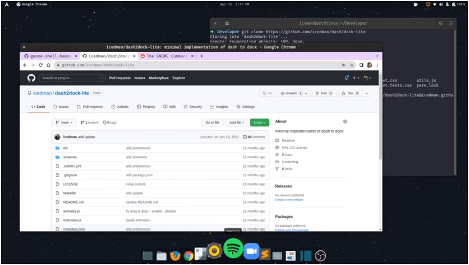

<br/>
<p align="center">
  <h3 align="center">Dash2Dock Lite</h3>

  <p align="center">
    A GNOME Shell 40+ Extension
    <br/>
    <br/>
  </p>
</p>

     

## About The Project




## Getting Started

This is an example of how you may give instructions on setting up your project locally.
To get a local copy up and running follow these simple example steps.

### Prerequisites

Requirements:

* GNOME Shell (version 40+)


### Installation

Manual Installation: 
- Clone this repo
```bash
$ git clone https://github.com/icedman/dash2dock-lite.git
```
- Use the `Makefile` to build and install
```bash 
$ cd dash2dock-lite
$ make
```

Using the AUR (Arch User Repository):
*This requires an Arch-based distribution to work:*
```bash
$ git clone https://aur.archlinux.org/gnome-shell-extension-dash2dock-lite.git
$ makepkg -si
```

## License

Distributed under the GPL 3.0 License. See [LICENSE](https://github.com/icedman/dash2dock-lite/blob/main/LICENSE.md) for more information.
