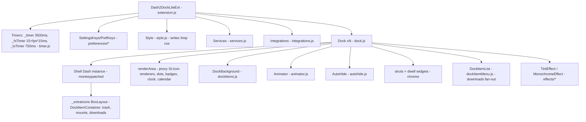

# D2DA — Dash2Dock Animated: Agent Context, Goals, Inventory & Findings

> **Purpose of this file.** Give any agent/human enough context to make *targeted* changes without
> re-reading 9.6k lines. Use the **Code Map** and **"Where is X?"** tables to narrow lookups, the
> **Coupling Register** before touching anything that talks to GNOME Shell, and the **Findings** /
> **Roadmap** to pick work.
>
> - Line numbers are pinned to commit `f876684` (main). Re-verify with `grep -n` after edits.
> - `build/` is a **generated copy** (Makefile `publish`/`g44`). Never edit or grep it — exclude it.
> - Tags: **[verified]** = confirmed by reading code. **[inference]** = reasoned, not reproduced at runtime. **[verify]** = must check against the target GNOME Shell source.

---

## 1. Snapshot

| | |
|---|---|
| Name / UUID | Dash2Dock Animated — `dash2dock-lite@icedman.github.com` |
| Shell versions | 45, 46, 47, 48, 49, 50 (`metadata.json`), ESM modules, no `session-modes` (disabled on lock screen ⇒ full disable/enable every lock) |
| Settings schema | `org.gnome.shell.extensions.dash2dock-lite` (97 keys) |
| Size | ~9.6k LOC JS. Core: `dock.js` 1644, `extension.js` 1226, `animator.js` 1189, `services.js` 772 |
| Install / run | `make install` → copy to `~/.local/share/gnome-shell/extensions/<uuid>`; `make test-shell` (nested `gnome-shell --devkit`; needs the `mutter-devkit` package for the viewer window, otherwise the shell runs headless) ; `make test-prefs` |
| Release | `make publish` → `build/` → zip (**omits `themes/`** — bug T-4) |
| Lint / tests | ESLint config is legacy `.eslintrc.yml` (broken with ESLint 9, no `sourceType: module`). No CI. In-shell self-test via `diagnostics.js` triggered through `msg-to-ext` **eval**. |

### What it does
Replaces the overview Dash with a dock on screen edges (bottom/left/right/top) with macOS-like magnify/spread/rise animation, bounce, autohide + window dodging, multi-monitor docks, running dots & notification badges, special items (trash, downloads list, mounted volumes, clock, calendar), icon tint/monochrome shader effects, topbar/label theming, blur-my-shell & compiz-magic-lamp integration.

---

## 2. Architecture

### 2.1 Core rendering trick ("proxy rendering") — read this first
The dock **instantiates GNOME Shell's own `Dash`** (`dock.js:362 createDash`) and uses it only for *layout, app list, DnD, labels and menus*. Its icons are made invisible (`_icon.opacity = 0`, `dock.js:633`). Every frame, `Animator.animate` reads each hidden icon's transformed position and draws a **proxy `St.Icon` ("renderer")** in `dock.renderArea` with the computed scale/translation (`animator.js:548-779`). Dots, badges, clock, calendar are separate overlay actors that follow the renderer. `DockBackground` is sized from the first/last icon.

Consequence: almost everything depends on the **internal structure of the Shell Dash** (`DashItemContainer → DashIcon/AppIcon → BaseIcon/IconGrid → StIcon`, `_dot`, `label`, `_draggable`, `_showAppsIcon`, `_box`, `last_child`). This is the #1 source of GNOME-update breakage.

### 2.2 Object graph

### 2.3 Lifecycle & control flow

- `enable()` (`extension.js:166`): create 3 Timers → `_enableSettings` (mirror every key to `this.<snake_case>`) → `_loadConfig` (async, **not awaited**) → hide overview dash → Integrations → Services → style/layout updates → `_addEvents` → after 250 ms `startUp()` → `createTheDocks()`.
- `disable()` (`extension.js:244`): shut down timers → remove events → settings off → `destroyDocks()` (**undock only, nothing destroyed**) → services/integrations off → unload styles.
- **Animation loop**: any event → `dock._beginAnimation()` (`dock.js:1262`) subscribes `animate` to `_hiTimer.runLoop`. `animate` → `animator.animate(dt)`. When nothing moves → `_debounceEndAnimation` (750 ms + interval on `_loTimer`) → `_endAnimation` cancels the loop.
- **Event fan-out**: `extension._onFocusWindow/_onFullScreen/_onRestacked/_onAppsChanged` iterate `this.listeners = [services, ...docks]` (`extension.js:61, 836-863`).
- **Settings**: `connectSettings` callback (`extension.js:465`) sets `this[name_snake] = value`, then a large `switch` (`extension.js:471-652`) triggers side effects.
- **Services loop**: `_timer.runLoop(_onCheckServices, 2500)` → `services.update()` (trash, notifications, clock, calendar, downloads).

### 2.4 Per-frame pipeline (`Animator.animate`, `animator.js:107-1042`)

| Lines | Step |
|---|---|
| 115 | `dock.layout()` — **full relayout every frame** (perf P-1) |
| 120 / 58-104 | `_precreateResources` — grow renderer/dot/badge pools |
| 125-139 | dock fade-in |
| 141-172 | pointer (real or simulated), `isWithin`, fullscreen check |
| 187-239 | per-icon transformed position, nearest icon |
| 247-358 | magnify scale via easing (`Quadratic`/`Cubic` EaseOut) |
| 360-415 | spread translation, re-center to hovered icon |
| 437-543 | position interpolation (Vector), jitter lock cache |
| 548-779 | renderer: icon override maps, size interpolation, position commit, label placement |
| 783-858 | badges, dots, `services.updateIcon` (clock/calendar) |
| 862-887 | separators |
| 889-959 | autohide slide in/out translation |
| 962-1023 | background, struts geometry, transparency |
| 1031-1039 | DockItemList animate, end-animation debounce |
| 1041 | `integrations.bms_update_size` |
| 1044-1188 | `bounceIcon` (frame sequence on `_hiTimer.runAnimation`) |

---

## 3. Code Map (inventory)

### 3.1 Root modules

| File | Purpose | Key symbols (line) |
|---|---|---|
| `extension.js` | Entry; owns timers, settings mirror, docks, global events, CSS generation | `createDock` 54, `createTheDocks` 66, `destroyDocks` 123, `recreateAllDocks` 133, `_showMainOverviewDash` 144, `enable` 166, `disable` 244, `animate` 285, `checkHide` 301, `startUp` 309, `_queryDisplay` 328, `_loadConfig` 351, `_enableSettings` 445 (switch 471-652), `_addEvents` 677, `_removeEvents` 801, `_onIconThemeChanged` 826, listener fan-out 836-863, overview 865/878, `_updateWidgetStyle` 899, `_updateAnimationFPS` 947, `_updateStyle` 997, `_updateBorderStyle` 1123, `_updateAutohide` 1170, `runDiagnostics` 1193, `lookup_icon_from_names` 1210, `file_explorer` 1219 |
| `dock.js` | `Dock` St.Widget per monitor: wraps Shell Dash, layout, chrome, input, window actions | exports `DockPosition` 33, `DockAlignment` 40, `Dock` 52. `_init` 55, `destroyDash` 144, `recreateDash` 164, `createItem` 176, `dock` 188, `undock` 198, input handlers 207-228, listener hooks 248-280, effects 282-334, `slideIn/Out` 336/343, `getMonitor` 353, `createDash` 362, `add/removeFromChrome` 422/452, `_preferredIconSize` 470, `_getStIconFromAppwell` 519, `_inspectIcon` 543, `_cleanupIcon` 660, `_findIcons` 676, `_updateExtraIcons` 856, `layout` 985, `_updateTransparenies` 1177, `animate` 1210, `_beginAnimation` 1262, `_endAnimation` 1295, `_debounceEndAnimation` 1321, `cancelAnimations` 1337, `_updateFocusedIcon` 1344, `_maybeMinimizeOrMaximize` 1362, `_maybeBounce` 1452, `getAppWindowsFiltered` 1476, `_onScrollEvent` 1515, `_cycleWindows` 1580 |
| `animator.js` | Per-frame animation + proxy renderers + bounce | `Animator` 37: `enable` 38, `disable` 47, `_precreateResources` 58, `animate` 107, `bounceIcon` 1044. Constants 28-35 |
| `autohide.js` | Per-dock autohide, pressure sense, window dodge | `AutoHide` 28: `enable` 29, `disable` 38, `_onMotionEvent` 65, `_onEnter/LeaveEvent` 124/130, `show/hide` 145/155, `_track/_untrack` 162/182, `_checkOverlap` 193, `_debounceCheckHide` 279, `_checkHide` 295 |
| `timer.js` | Home-grown scheduler over `GLib.timeout_add` | `Timer` 5: `initialize` 12, `shutdown` 22, `start/stop` 28/44, `hibernate` 75, `onUpdate` 134, `subscribe` 166, `unsubscribe` 192, `runLoop` 228, `runUntil` 250, `runOnce` 274, `runDebounced` 296, `runSequence` 318, `runAnimation` 349, `cancel` 401 |
| `services.js` | Trash, downloads, mounts, notifications, clock/calendar ticks; writes `/tmp/*.desktop`; also renders clock/calendar position (`updateIcon`) | `Services` 40: `enable` 41, `disable` 125, `setupDownloads` 136, `_commitMounts` 174, `_onMountAdded/Removed` 184/197, `update` 207, `setupTrashIcon` 213, `setupFolderIcon(s)` 236/256, `setupMountIcon` 281, `checkNotifications` 319, `checkTrash` 387, `checkRecentFilesInFolder` 403, `checkRecents` 585 (no-op), `_debounceCheck*` 595/621, `_getMountName` 637, `checkMounts` 658, `updateIcon` 686 |
| `dockItems.js` | Dock item actors | `DockItemMenu` 25, `DockItemOverlay` 67, `DockItemDotsOverlay` 84, `DockItemBadgeOverlay` 143, `DockIcon` 174 (`_createIcon` 190), `DockItemContainer` 242 (`activateNewWindow` 317), `DockBackground` 329 (`update` 339) |
| `dockItemMenu.js` | **Misnamed** — holds `DockItemList` (downloads fan-out list) | `DockItemList` 21: `createItem` 44, `slideIn` 97, `slideOut` 314, `animate` 321 (runs `_animate` 6×), `_animate` 330 |
| `integrations.js` | Hooks into compiz-magic-lamp & blur-my-shell | `Integrations` 5: `hookCompiz` 16, `releaseCompiz` 36, `compiz_getIcon` 42, `hookBms` 144, `releaseBms` 170, `bms_update_size` 175 (per frame) |
| `style.js` | Generated CSS → `/tmp/<user>-*.css` → `St.Theme.load_stylesheet` | `Style` 8: `unloadAll` 14, `build` 29, `rgba` 65, `hex` 72 (unused) |
| `utils.js` | Helpers | `tempPath` 21, `getPointer` 26, `warpPointer` 30, `setTimeout/Interval/clear*` 34-54 (unused), `get_distance_sqr` 56, `get_distance` 62 (unused), `isOverlapRect` 66, `isInRect` 82, `trySpawnCommandLine` 90, `loadFile` 101 |
| `drawing.js` | Cairo helpers for canvases | `Drawing` 134 (`set_color` 116, `draw_*` 8-130) |
| `vector.js` | Immutable 3D vector (allocates per op) | `Vector` 1 |
| `diagnostics.js` | Scripted self-test (fake pointer, cycles settings) | `runTests` 255 |
| `monitors.js` | **Prefs-side** monitor list via Mutter DBus `DisplayConfig` | `MonitorsConfig` 7 |
| `prefs.js` | Adw prefs window | `Preferences` 21: `addMenu` 59, `updateFolders` 104, `selectFolder` 111, `addButtonEvents` 127, `fillPreferencesWindow` 163, `preloadPresets` 241, `_buildThemesMenu` 270, `loadPreset` 294, `updateMonitors` 359 |
| `preferences/keys.js` | Declarative key registry (92 keys: default, widget_type, options, test, themed) | `schemaId` 9, `SettingsKeys(patch)` 11 |
| `preferences/prefKeys.js` | GTK-agnostic binding engine shared by prefs & extension | `PrefKeys` 3: `setValue` 54, `getValue` 90, `connectSettings` 115, `disconnectSettings` 224, `connectBuilder` 231 |

### 3.2 Sub-directories

| Path | Contents / status |
|---|---|
| `apps/clock.js`, `apps/calendar.js` | Cairo `St.DrawingArea` widgets (Clock 125, Calendar 8) |
| `apps/dot.js` | Running-indicator / badge renderer, 8 styles (`Dot` 11, `set_state` 50, `vfunc_repaint` 71) |
| `apps/overlay.js` | **Dead** (uses removed `Clutter.Canvas`; `destroy(){}` override) |
| `apps/recents.js`, `apps/*.desktop`, `apps/empty-trash.sh` | Mostly **dead** (only `recents-…desktop` referenced, with `show:false`) |
| `effects/{tint,monochrome}_effect.js` + `.glsl` | Used (`dock.js:16-17`). `blur_` and `color_` are **unused**. All four ~96% duplicated |
| `effects/easing.js` | Only `Linear`, `Bounce`, `QuadraticEaseOut`, `CubicEaseOut` used (~200/292 lines dead) |
| `ui/*.ui` | Adw prefs pages: general, appearance, tweaks, others, menu. Widget id == settings key |
| `ui/legacy/*.ui`, `tests/generate_legacy.py` | **Dead** pre-Adw UI, still shipped by `publish` |
| `themes/*.json` | Prefs presets (dark/light) |
| `tools/transpile.py`, `tools/imports_*.js`, Makefile `g44*` | **Obsolete** GNOME 42-44 transpiler (also produces invalid JSON) |
| `tests/*` | Ad-hoc gjs scripts, no harness |

### 3.3 "Where is X?"

| Concern | Look at |
|---|---|
| Icon magnify/spread/rise math | `animator.js:247-415` |
| Icon position/size smoothing | `animator.js:437-543`, `624-652` |
| Labels on hover | `animator.js:707-774`; label patch `dock.js:786-796` |
| Bounce on launch | `dock.js:1452 _maybeBounce` → `animator.js:1044 bounceIcon` |
| Click: minimize/maximize/raise | `dock.js:809-822` (activate patch) → `dock.js:1362` |
| Scroll to cycle windows | `dock.js:1515`, `1580` |
| Autohide / dodge windows | `autohide.js:193-310`; slide translation `animator.js:889-959` |
| Struts / input region / chrome | `dock.js:422-461`, struts geometry `animator.js:978-1020`, dwell `dock.js:1153-1172` |
| Which icons exist / extra items | `dock.js:676 _findIcons`, `543 _inspectIcon`, `856 _updateExtraIcons` |
| Icon size / scale factor | `dock.js:470 _preferredIconSize`, `985 layout` |
| Multi-monitor | `extension.js:66 createTheDocks`, `328 _queryDisplay`, `970`; `dock.js:353 getMonitor`, `1476 getAppWindowsFiltered` |
| Running dots / badges | `dockItems.js:84-172`, `apps/dot.js`; placement `animator.js:783-849` |
| Notification counts | `services.js:319 checkNotifications` → `services._appNotices` |
| Trash / mounts / downloads | `services.js:213, 281, 136, 403, 637-680`; actors `dock.js:856-963`; list `dockItemMenu.js` |
| Clock / calendar | `apps/clock.js`, `apps/calendar.js`; positioned per-frame in `services.js:686 updateIcon` |
| Generated CSS (radius, colors, topbar, labels) | `extension.js:997 _updateStyle`, `1123 _updateBorderStyle`, `style.js` |
| Icon tint/monochrome effects | `dock.js:282-334`, `effects/*` |
| Settings → runtime reaction | `extension.js:471-652` |
| Prefs UI binding | `preferences/prefKeys.js:231 connectBuilder`, `prefs.js:163` |
| User config overrides (`~/.config/d2da/{config.json,icons.json,style.css}`) | `extension.js:351-443`, used in `animator.js:559-591`, `dock.js:494`, `1004` |
| Blur-my-shell / magic-lamp | `integrations.js`; fake Dash-to-Dock surface `dock.js:58, 78-97` |
| Self-test | `diagnostics.js`, `extension.js:1193`, prefs button → `msg-to-ext` |

### 3.4 Conventions you must know
- **Settings mirror**: every key `foo-bar` is available as `extension.foo_bar`; keys with `options` also get `extension.foo_bar_options` (`extension.js:655-663`). Widget id in `ui/*.ui` == key name.
- **Expando properties on Shell actors** (private, ad hoc): `_icon, _appwell, _label, _grid, _button, _dot, _renderer, _pos, _target, _scale, _targetScale, _translate, _prev, _next, _idx, _found, _handled, _positionCache, _locked, _image, _menu, _mountType, _mountPath, _bounce, _cls, _destroyConnectId…` on `DashItemContainer`s; `_tracked`, `_parent` on `Meta.Window`; `__box` on `Main.overview.dash`; `d2dl` on `Main.overview`.
- **Timer subscriptions** are plain objects; re-passing the returned object to `runDebounced(obj)` / `runLoop(obj)` resets/re-subscribes it. Debounce handles stored as `this._xxxSeq`.
- Dock positions are string constants (`DockPosition`) but many places compare raw strings (`'left'`, `'bottom'`).

---

## 4. GNOME Coupling Register (update-fragility hot list)

Everything here can break on a Shell release. **Goal: route all of it through one `compat.js`** with feature detection (no version sniffing) and graceful fallback.

| # | Coupling | Where | Safer alternative |
|---|---|---|---|
| C1 | Instantiate + monkeypatch Shell `Dash` (`_adjustIconSize`, `_createAppItem`), rely on `_box`, `_background`, `_showAppsIcon`, `last_child` (= `_dashContainer`) | `dock.js:362-419, 986-993, 1122-1123` | Short term: accessors in compat. Long term: own icon model from `AppFavorites` + `AppSystem` running apps (see R-12) |
| C2 | Dash item internal tree: `child.icon.icon`, `_iconBin.child`, `_createIconTexture`, `_dot`, `label`, `_draggable` | `dock.js:519-655, 829-839` | Single `getIconParts(item)` in compat |
| C3 | Per-instance monkeypatch of `AppIcon.activate`, `showLabel` | `dock.js:786-822` | Connect to `clicked`/button-press on container, or subclass via own item model |
| C4 | `Main.overview.dash` internals: `_box`, `__box` expando, `_background.style`, `_showAppsIcon.child`, `last_child.visible` | `extension.js:144-164, 206, 733` | Hide overview dash via one style class / `visible`; restore exactly |
| C5 | `AppFavorites._getIds()` (private) | `dock.js:267, 1269` | `getFavorites()` / `isFavorite(id)` + cache on `changed` |
| C6 | `appwell._id` | `animator.js:1046, 1060` | `appwell.id` getter or `appwell.app.get_id()` [verify] |
| C7 | Overview lookup by walking `Main.uiGroup` → `overviewGroup` → `overview._delegate` | `dock.js:754-762` | `Main.overview.toggle()` / `Main.overview.showApps()` |
| C8 | `Meta.Window.maximize(3)/unmaximize(3)/get_maximized()` | `dock.js:1402-1410` | GNOME 49 dropped flags (`is_maximized()`, no-arg `maximize`) [verify]; feature-detect arity |
| C9 | `Clutter.Event` field access `evt.modifier_state` | `dock.js:1593` | `evt.get_state()` (events are opaque since 45) [verify] |
| C10 | `Config.PACKAGE_VERSION[0] == '4'` | `dock.js:431` | Remove — `affectsInputRegion` defaults to `true` anyway |
| C11 | `Clutter.ShaderEffect` + GLSL `texture2D`; `Shell.get_file_contents_utf8_sync` | `effects/*` | Verify on 49/50; consider `Shell.GLSLEffect`; read shader once, cache |
| C12 | DashIcon/DashItemContainer subclassing, `_createIcon` override, `_draggable` handler patching, `_menuManager`, `DesktopAppInfo` via `get_installed()[0].constructor` (GioUnix move) | `dockItems.js:174-311` | `GioUnix.DesktopAppInfo ?? Gio.DesktopAppInfo` import-time probe in compat |
| C13 | Notification Source `_app/_appId` fallbacks, `Main.messageTray.getSources()` | `services.js:322-343` | Compat accessor; listen to `source-added/removed` + `notify::count` |
| C14 | `monitor.inFullscreen`, `geometry_scale` (JS fields on layoutManager monitors) | `autohide.js:61,146,233`, `dock.js:212,1017`, `animator.js:168` | Stable-ish; wrap anyway |
| C15 | Third-party internals: magic-lamp `stateObj.getIcon`; BMS `_dash_to_dock_blur.update_size`, `CornerEffect` name match, `metadata.version >= 70` | `integrations.js:16-271` | Isolate, version-gate, try/catch, no per-frame tree walks |
| C16 | Impersonating Dash-to-Dock (`name: 'dashtodockContainer'`, `fake_dash`, `_slider`) for BMS | `dock.js:58, 78-97` | Keep but document; CSS must not leak to real Dash-to-Dock (see B-28) |
| C17 | Global expando `Main.overview.d2dl` | `extension.js:167, 281`; `dockItems.js:257-266` | Pass extension ref explicitly / module singleton |
| C18 | Mutter DBus `DisplayConfig.GetCurrentState` (prefs) | `monitors.js:15-25` | Fine; add `destroy()` |

---

## 5. Goals & Acceptance Criteria

| Goal | Concrete, checkable criteria |
|---|---|
| **G1 Bug-free lifecycle** | 50× disable/enable (lock/unlock) and 10× monitors-changed leave actor count in `global.stage`/`Main.uiGroup`, number of Dash instances, signal handlers and GLib sources **unchanged**. No `GLib-CRITICAL`/JS errors in `journalctl -f -o cat /usr/bin/gnome-shell`. |
| **G2 Speed** | Idle dock = **zero** wakeups except the services tick. Animation driven by the actor frame clock (vsync, high-refresh capable). No `layout()`/allocation churn per frame; no DrawingArea repaint unless state changed; no sync I/O on main loop. |
| **G3 GNOME-update impervious** | All Shell-private access lives in `compat.js` behind feature detection; any missing internal degrades a feature instead of throwing in `enable()`. No version-string sniffing. |
| **G4 Elegance** | One responsibility per module; settings reactions declared as data; no dead code/files; effects share one base class; consistent naming (`dockItemList.js`). |
| **G5 EGO-review clean** | No `eval`, no `/tmp` shell launchers, no `rm -rf`, everything created in `enable()` destroyed in `disable()`, `gnome-extensions pack` based release, working ESLint. |

---

## 6. Findings

### 6.1 Bugs — High

| ID | Where | Problem | Tag |
|---|---|---|---|
| **B-1** | `extension.js:123 destroyDocks`, `dock.js:144 destroyDash`, `660 _cleanupIcon`, `1314 _destroyList`, `876/934/953` | **Nothing is ever `destroy()`ed** (grep: zero real `destroy()` calls). Dock widgets, struts/dwell, renderers/dots/badges, Shell `Dash` instances, `PopupMenu`s in `uiGroup`, `DockItemList`, clock/calendar are only `remove_child`'d. Leaked Shell `Dash` objects keep their internal AppSystem/AppFavorites/overview handlers alive and keep rebuilding icons. Leaks on **every screen lock** (no `session-modes`) and every monitors-changed. | verified (no destroy); Dash-handler part [inference — check `ui/dash.js`] |
| **B-2** | `timer.js:134-160` | No try/catch around subscribers. One throwing callback ⇒ GJS removes the GLib source but `_timeoutId` stays set ⇒ `is_running()` true forever, timer is **dead permanently**, later `source_remove` → GLib-CRITICAL. | verified code; GJS semantics [inference] |
| **B-3** | `autohide.js:252` | `w.get_workspace().index()` — ~~`get_workspace()` is `null` for "on all workspaces" windows~~ **Corrected (1.3 audit):** mutter returns the active workspace for sticky windows, so there was no TypeError; it can be null only while a window is being set up or removed. Fixed as a defensive `?.` guard + `is_on_all_workspaces()` in dda62a5. | wrong premise |
| **B-4** | `autohide.js:254` | `w.get_window_type() in handledWindowTypes` tests **array indices** not values. Dodging uses wrong window types (NORMAL, DESKTOP, DOCK, DIALOG; misses MODAL_DIALOG, UTILITY). Use `.includes()`. | verified |
| **B-5** | `extension.js:76-79` | `let d_monitor = …` then uses `dc_monitor` ⇒ **ReferenceError**; the `config.json` `docks` feature can't work. | verified |
| **B-6** | `extension.js:984-994, 1160-1168` + `timer.js:166-178` | `_debounceStyleSeq` / `_iconSpacingDebounceSeq` survive disable/enable. After re-enable, the stale object (closures bound to the *old* Timer, colliding `_id`s starting at `0xff`) is pushed into the new Timer and never unsubscribes ⇒ callback runs **every tick forever** (e.g. `_updateStyle` at ~66 Hz) or overwrites an unrelated subscriber. | [inference, strong] |
| **B-7** | `extension.js:61, 123-131, 836-863` | `this.listeners` is rebuilt only in `createDock`; `destroyDocks` doesn't clear it. For the 500 ms until `startUp` (and forever if no new dock), events reach undocked docks ⇒ `_beginAnimation` starts a loop whose `layout()` fails (`dash` null) ⇒ possible **zombie 66 Hz loop** logging "unable to layout()". | [inference] |
| **B-8** | `services.js:220-224` | "Empty Trash" = `rm -rf "<cwd>/.local/share/Trash"` (whole dir incl. `info/`, cwd-relative, no confirm, `Terminal=true`). Use Gio (`trash:///` delete children) or `gio trash --empty`. | verified |
| **B-9** | `services.js:637-656` | `_getMountName` computes a name then `return 'Volume'` ⇒ all mounts share one `.desktop`, stale labels/paths; unmount of one hides all. | verified |
| **B-10** | `utils.js:21` (used by services/style/dock) | Predictable `/tmp/<user>-*.desktop|css` ⇒ other local users can pre-plant launchers (Exec runs on click) or DoS `enable()`. Use `GLib.get_user_runtime_dir()` or in-memory `GLib.KeyFile` → `DesktopAppInfo.new_from_keyfile`. Paths also injected unquoted into `Exec=` (`services.js:246, 304-306`, `dockItemMenu.js:65,175`). | verified |
| **B-11** | `extension.js:472-481`, `prefs.js:158` | `eval()` of a GSettings string (`msg-to-ext`) — arbitrary code in gnome-shell for anyone who can write dconf; EGO rejection risk. Replace with whitelisted commands. | verified |
| **B-12** | `ui/tweaks.ui:171, 268` | `pressure-sense-sensitivity` and `scroll-sensitivity` share `scroll-sensitivity-adjust` ⇒ moving one writes both; opening prefs overwrites one. | verified |
| **B-13** | `extension.js:730-737` | On `startup-complete`, `Main.overview.dash.last_child.visible = false` — never restored in `disable()` ⇒ overview dash stays hidden after disabling. | verified |

### 6.2 Bugs — Medium

| ID | Where | Problem |
|---|---|---|
| B-14 | `animator.js:525` | `dock.animation_fps` is always `undefined` (it lives on `extension`) ⇒ fps-dependent branch never taken. |
| B-15 | `animator.js:225-227` | `icon._next = icon` (self) — should be `prevIcon._next = icon`. Breaks jitter-lock neighbour logic (`491-495`) and clobbers `_next` set in `dock.js:845-851` used by separators. |
| B-16 | `extension.js:575 & 592` | Duplicate `case 'icon-size'` ⇒ second unreachable; `_updateShrink` never runs on icon-size change. |
| B-17 | `dock.js:1593` | `evt.modifier_state` undefined on 45+ ⇒ Ctrl-scroll "current workspace only" never applies. Use `evt.get_state()`. [verify] |
| B-18 | `dock.js:1373-1386` | Null `event` ⇒ `event.type()` throws; thrown error is swallowed at `dock.js:818-820` so **the app is not activated at all**. Middle-button detection uses `BUTTON3_MASK` and pre-press state. |
| B-19 | `dock.js:201, 460` | Effect removal targets `dash._box` / its parent, but effects live on `renderArea` and `_list._box` (`305-320`). |
| B-20 | `extension.js:831` vs `1212` | Icon-theme change assigns `this._iconTheme`; lookups use `this.icon_theme` ⇒ stale theme. |
| B-21 | `extension.js:196, 351` + `utils.js:101-119` | `_loadConfig` is async and not awaited (race with `startUp` reading `_config`); `loadFile` throws inside the callback ⇒ promise never settles; `if (!ok) reject` lacks `return`. |
| B-22 | `extension.js:353,386,397,411,424,437`; `services.js:142-150, 262, 268`; `dock.js:915`; `prefs.js:233` | Paths relative to process cwd (`.config/d2da`, `Downloads`, `.local/share/Trash`). Use `GLib.get_user_config_dir()`, `get_user_special_dir(DIRECTORY_DOWNLOAD)`, `get_user_data_dir()`. |
| B-23 | `timer.js:181-186`, `extension.js:947-955` | Timer restarts only when `subscribers.length == 1`; `_updateAnimationFPS` does `shutdown(); initialize()` with live subscribers ⇒ animations can freeze. |
| B-24 | `timer.js` + `_loTimer(750)` | Delays below resolution collapse: the 120 ms autohide debounce fires 0-750 ms later; `runSequence` adds previous delay (`timer.js:338`); `runAnimation` `typeof func` typo (`350-352`). |
| B-25 | `services.js:207-211`, `extension.js:47,177,796` | Services told `dt=2500` but tick every 3500 ms ⇒ everything 1.4× slow; no per-service try/catch. |
| B-26 | `autohide.js:223` | `isInRect(arect, pointer)` without `pad` ⇒ NaN ⇒ always false (dead check). |
| B-27 | `autohide.js:106-113` | Pressure-sense handles left/right/bottom only; TOP dock never triggers. |
| B-28 | `stylesheet.css:20-24`, `dock.js:57-58` | `#dashtodockcontainer *, #d2daDock * { margin/padding: 0 !important }`: dock name is `dashtodockContainer` (case differs) and `d2daDock` is commented out ⇒ rules either dead or (if St matches case-insensitively) clobber inline icon-spacing margins and **real Dash-to-Dock** styling. [verify] |
| B-29 | `dockItems.js:304-311`, `dockItemMenu.js` | PopupMenus/DockItemList never destroyed (subset of B-1), menu side always `TOP`. |
| B-30 | `apps/calendar.js:25`, `apps/dot.js:28` | `redraw()` forces `visible = true` ⇒ disabled calendar reappears on tick. |
| B-31 | `autohide.js:51,164-186,243` | `_tracked`/`_parent` expandos on shared `Meta.Window` ⇒ multi-dock duplicate/leaked handlers. |
| B-32 | `prefs.js:236,369` + `prefKeys.js:262-266` | Replacing monitor dropdown model after binding likely resets `preferred-monitor` to 0 on every prefs open. [inference] |
| B-33 | `prefs.js:294-354`, `prefKeys.js:182-219` | Presets: no `scale` case, color buttons don't refresh, handlers never disconnected; `changed::` doesn't update widgets (Reset looks broken); `JSON.parse` uncaught; `downloads-path` cleared before folder dialog. |
| B-34 | `animator.js:1159-1187` | Bounce end resets `translation_y` only ⇒ left/right docks may keep an x offset. [verify] |
| B-35 | `integrations.js:175-271 bms_update_size` [inference] | Every `enable()` logs `GLib-GObject-CRITICAL: value "nan" … for property 'clip'`. Seen only with the user's real dconf (blur-my-shell enabled), never in isolated smoke ⇒ likely a NaN geometry (`_background`/`renderArea`/`meta_background` size before first allocation) flowing into BMS's effect `clip` property. Reproduce: `D2DA_SMOKE_REAL_DCONF=1 tools/smoke-shell.sh`. Guard with `Number.isFinite` and skip until allocated. |
| B-36 | `services.js` `setupDownloads` / recents debounce [verified c84f252] | Recents and downloads debounces share one `_debounceCheckSeq` handle on `_loTimer`. `setupDownloads()` arms it first, so later recents re-arms run `checkDownloads` (and vice versa, depending on order) ⇒ one of the two checks is starved/replaced. | One handle per job (`_debounceDownloadsSeq`, `_debounceRecentsSeq`), both reset in `disable()`. R-8. |
| B-37 | `style.js` CSS path / `Style.unloadAll` [verified 1b03ca7 audit] | Every shell instance (live session and nested smoke shell) writes and deletes the same `/tmp/<user>-custom-d2dl.css`. One instance's `disable()` deletes the file the other still uses ⇒ intermittent `Style.unloadAll` error signature in smoke (seen twice, then not reproduced), and a stale or missing stylesheet in the live session. | R-9d: per-instance path in `$XDG_RUNTIME_DIR` (or in-memory stylesheet); ignore G_IO_ERROR_NOT_FOUND on delete. |
| B-38 | `dock.js _findIcons` [verified 30ae2d5 audit] | After `destroyDash()` (`dash = null`), the cached-icons branch reads `this.dash._box` ⇒ TypeError on the second call. Bounce frames no longer reach it (R-7a guard), but any late caller would. | `if (!this.dash) return [];` (or equivalent) before the cache check. R-7d. |
| B-39 | `dock.js _updateExtraIcons` [verified 0a01a50 audit] | Unmounted volumes and unpinned trash/downloads items are only removed from the box, not destroyed ⇒ their `DockItemMenu` stays in `uiGroup` at runtime. | `item.destroy()` (R-7b's container destroy handler then tears down the menu). R-7d. |
| B-40 | `dock.js destroyDash` [0a01a50 audit, Low] | Cleans up only items `_findIcons` returns; hidden items (non-favorites with favorites-only) are skipped ⇒ a clock/calendar created before that toggle is never destroyed. Also: rebuilding only an item's icon (not the container) destroys that item's menu (rare). | Iterate all box children for cleanup. R-7d. |

### 6.3 Bugs — Low (batch these)
`extension.js:16` SPDX typo; `extension.js:20` `('use strict')` no-op; `extension.js:62` sets `this._monitorIndex` on extension (meant dock); `extension.js:817-824` `_onKeyPressed` uses un-imported `Clutter` (dead); `extension.js:812` disconnects never-connected stage; `dock.js:1540` `MAX*sens || 0` precedence; `dock.js:1529` magic `== 5` (use `Clutter.InputDeviceType.TOUCHPAD_DEVICE`); `dock.js:482` unexplained `upscale` formula; `integrations.js:50,89,223` (`-1` monitor, `0` coords falsy, `&& 0`); `clock.js:95-109` hour/minute colours swapped, `:343` hardcoded `_hideIcon`; `drawing.js:119-122` Cogl colour 0-255 passed as 0-1, `if (clr.red)`; `style.js:68,76` alpha rounding / hex padding; `monitors.js:50-103` duplicates, null deref; `services.js:660` `_mounts` object→array; `dockItemMenu.js:177` `l.type.includes` on null; `.desktop` templates broken (`$(…)` in Exec, wrong Name); `effects/blur_effect.glsl:24` 9 taps / 2.0. `autohide.js _checkOverlap` reads `monitor.index` before null-checking `monitor` [inference]; `animator.js` (~891) dead `_hidden && isWithin → slideIn` (`_isWithinDash` is false while hidden, so it never fires; per human rule 1.3 a hidden dock reveals only via the edge strip ⇒ delete in R-18). `extension.js` `msg-to-ext` command map is a plain object ⇒ `'toString'`/`'constructor'` match built-ins (harmless, no code exec); use `Object.hasOwn` or a `Map` [3311461 audit nit]. `prefs.js fillPreferencesWindow` writes `msg-to-ext=''` on every open ⇒ may add a dconf key; write only if not already '' [5840f29 audit]. `preferences/prefKeys.js` switch handler reads `get_active()` mid-change (old value) and calls the key callback twice; dropdown `key_maps` not reverse-applied when setting the widget (all maps empty today) [5840f29]. `diagnostics.js runTests` writes every setting to real dconf and restores at the end; no abort/restore if the extension is disabled mid-run [03940ad audit]. `windowTracker`: turning dodge off (autohide still on) doesn't `clear()` the tracker (callbacks only trigger an early-exit `checkHide`); windows moving to another monitor/workspace stay tracked until close [deb31fb audit].

### 6.4 Performance hotspots

| ID | Where | Cost | Fix |
|---|---|---|---|
| **P-1** | `animator.js:115` → `dock.js:985 layout()` | Full relayout **every frame**: `_updateExtraIcons`, `getMonitor/_queryDisplay`, `_findIcons` (2× `get_children()` arrays), per-icon width/height/style writes, orientation, text_direction, dwell geometry. | Dirty-flag layout: run only on settings/monitor/app/icon-set change. |
| **P-2** | `timer.js:35`, `extension.js:181, 951` | Animation on a 15-45 ms `GLib.timeout` — not vsync-aligned (judder), nominal `dt`, capped ~66 Hz on 120/144 Hz, wakeups while idle-waiting. | Drive with the actor's frame clock (`Clutter.Timeline({actor, duration, repeat_count:-1})` `new-frame`, measured `dt`), stop when settled. |
| **P-3** | `animator.js:189-543` | Per-icon per-frame allocations: `new Vector` ×5, `[...pos]` copies, `get_transformed_position` ×2, PNG path string ops (`345-349`). | Inline scalar math; reuse arrays; cache "is raster" per gicon. |
| **P-4** | `animator.js:831`, `dock.js:1269` | `getAppWindowsFiltered` → `app.get_windows()` per icon per frame; `Fav._getIds()` on every motion event. | Cache window counts on `app` `windows-changed` / `app-state-changed`; favorites on `changed`. |
| **P-5** | `dockItems.js:168`, `apps/dot.js:51-59` | Badges (and dots with unset colour) **repaint every frame** — array literals compared by reference. | Compare contents / hoist constants; repaint only on change. |
| **P-6** | `services.js:686-771` | Clock/calendar geometry + `show()` per icon per frame. | Move to animator renderer step; set only on change. |
| **P-7** | `dockItemMenu.js:321-328` | `DockItemList._animate` ×6 per frame + `get_transformed_size` per label. | Single pass with proper `dt`; cache label sizes. |
| **P-8** | `integrations.js:175-271` | BMS tree walk + `get_effects()` + `constructor.name` per frame. | Resolve once on hook; update on geometry change. |
| **P-9** | `services.js:390, 411-456`; `effects/*:16-20`; `style.js:52-60` | Sync I/O on main loop: trash enumerate (gvfs DBus), full Downloads enumerate + icon lookup for every file, shader file read on every effect creation (also on each list open), CSS write + theme reload. | `*_async` + `Gio.Cancellable`; `trash::item-count`; top-N only; cache shader source per class; reuse effect. |
| **P-10** | `services.js:66-78` | Notifications polled every 5 s. | `messageTray` `source-added/removed` + source `notify::count`. |
| P-11 | `animator.js:595, 963` | `set_style_class_name('')` per renderer and `_background.style=` per frame (St short-circuits equal values, still churn). | Set on change only. |

### 6.5 Dead code / duplication (safe deletions after a grep)
- Files: `apps/overlay.js`, `apps/empty-trash.sh`, unused `apps/*.desktop` (except recents if kept), `effects/blur_effect.*`, `effects/color_effect.*`, `ui/legacy/`, `tests/generate_legacy.py`, `tools/transpile.py`, `tools/imports_*.js`, Makefile `g44*` targets + README section.
- Functions: `utils.js` timers & `get_distance`; `timer.js` `pause/resume/toggle_pause/restart/runUntil/runningTime`, duplicate `runOnce`≡`runDebounced`; `vector.js` unused ops; `easing.js` ~200 lines; `extension.js` `_onKeyPressed`, `_getPreferredColorScheme` (+ empty `color-scheme` handler 450-456), `_updateBlurredBackground(){}`, `_updateShrink` dead branch; `autohide.js` `_onFocusWindow/_onFullScreen`; `services.js` `checkRecents*` & commented block 462-527; `style.js hex`.
- Dead settings (UI visible, no effect): `experimental-features` (prefs-only since 03940ad: shows the self-test row), `topbar-blur-background`, `documents-icon`, `calendar-style`, `peek-hidden-icons`, `blur-resolution`, `disable-blur-at-overview`, `icon-border-color`, `icon-border-thickness`; schema-only: `debug`, `debug-log`, `monitor-count`, `msg-to-pref`, `theme`; schema + `keys.js` but never read: `animation-type`, `documents-path` [verified cff438d, check-settings].
- `keys.js` defaults drift from schema in 15 keys — derive from `settings_schema.get_key(k).get_default_value()`.
- Effects: 4 files ≈ 582 lines with ~10 unique lines ⇒ one `ColorShaderEffect` base.

### 6.6 Tooling findings

| ID | Where | Problem | Fix |
|---|---|---|---|
| T-5 | `tools/smoke-shell.sh` toggle loop [verified 2bbf52d] | Waits 4 s before the 1st disable but 1 s after each re-enable ⇒ `startUp()`'s pending `_loTimer.runOnce(…)` is still subscribed at later disables ⇒ probe `lo` delta +1 (artifact, not a leak). Strict mode also passes when 0 probe lines are logged (expected N+1/N is printed, not enforced). | Same settle wait before every disable; in strict mode FAIL if probe line counts ≠ N+1/N. |
| T-6 | `probe.js` [verified 2bbf52d] | Stage-walk counts can't see off-stage leaks: `destroyDocks()` already unparents docks, so B-1 leaks give delta 0 today. Absolute `stage` count varies between runs (2865-2885); only in-run deltas mean anything. | Add live-instance counters (e.g. module-level `Set`/counter incremented in `Dock`/`Dash`/`Animator` ctor, decremented on `destroy`), plus GLib source count if cheap. R-7d Accept uses these. |
| T-7 | `Makefile` `install`/`publish` [verified 2a0ae6f] | `install` copies `./*` (got `node_modules/` 14 MB, `agents/`, `eslint.config.js`, `package*.json`, dev docs); `publish` `cp *.js` ships `eslint.config.js`. Interim rm lines in 2a0ae6f; `CHECKLIST.md`, `DESIGN.md`, `ERRORS.md`, `HACKING.md` still installed. | R-0d: allow-list via `gnome-extensions pack`; `install` = install the packed zip. |
| T-8 | `tools/smoke-shell.sh` [verified 30ae2d5 audit] | The error-signature step runs before shell shutdown, so criticals logged during exit are never checked. Baseline at 03940ad and 30ae2d5: ~150 "sweeping phase of GC" criticals at shutdown (expected to drop as R-7 lands). | R-0e: build `.sig` after the shell exits (or count shutdown criticals as a probe/metric field). |

---

## 7. Roadmap — prioritized tasks

Effort: S ≤ 2h, M ≈ ½-1 day, L ≥ 2 days. Order within a phase = recommended order.

### Phase 0 — Safety net (do first)
| Task | Effort | Notes |
|---|---|---|
| R-0a **Leak/regression probe**: Looking Glass snippet (or `diagnostics.js` command) that prints counts of `Main.uiGroup` children, `global.stage` descendants, docks, `_hiTimer/_loTimer` subscribers (`extension.dumpTimers()` exists). Record baseline, run 20× disable/enable. | S | Measures G1 |
| R-0b ESLint flat config (`eslint.config.js`, `sourceType: 'module'`, GJS globals, ignore `build/`), `package.json` devDeps + scripts. | S | |
| R-0c `tools/check-settings.py`: schema ↔ `keys.js` ↔ `ui/*.ui` ids ↔ runtime refs; flags shared adjustments and duplicate `case` labels. | S | Catches B-12, B-16 class |
| R-0d Release via `gnome-extensions pack --extra-source=…` (include `themes/`, exclude legacy). Gitignore `schemas/gschemas.compiled`, `.antigravitycli/`. | S | Fixes zip missing `themes/` |

### Phase 1 — Correctness quick wins (low risk, high impact)
| Task | Fixes | Effort |
|---|---|---|
| R-1 Harden `Timer.onUpdate`: per-subscriber try/catch + `console.error`, clear `_timeoutId` on source death, restart when `length > 0 && !is_running()`, global id counter, tag entries with owner timer and reject foreign ones. | B-2, B-6, B-23 | S |
| R-2 Null all `*Seq` handles in `disable()` (extension, docks, autohide, services); clear `this.listeners` in `destroyDocks`. | B-6, B-7 | S |
| R-3 Autohide: `.includes()`, `w.is_on_all_workspaces() \|\| w.get_workspace()?.index() === ws`, pass `pad` to `isInRect`, TOP pressure sense. | B-3, B-4, B-26, B-27 | S |
| R-4 One-liners: `dc_monitor` (B-5), duplicate `icon-size` case (B-16), `extension.animation_fps` (B-14), `prevIcon._next` (B-15), `icon_theme` (B-20), `_getMountName` return `name ?? 'Volume'` + key mounts by root URI (B-9), effect removal targets (B-19), restore overview dash `last_child.visible` (B-13), `evt.get_state()` (B-17), null-safe event in `_maybeMinimizeOrMaximize` (B-18). | many | M |
| R-5 Prefs: separate adjustment for pressure sensitivity (B-12); populate monitor model before binding (B-32); `changed::` updates widgets; preset `scale` support + try/catch (B-33). | B-12, B-32, B-33 | M |
| R-6 Replace `msg-to-ext` eval with a command whitelist (`run-diagnostics`, `dump-timers`). | B-11 | S |

### Phase 2 — Lifecycle correctness (G1)
| Task | Effort |
|---|---|
| R-7 Real teardown: `Dock.destroy()` → `animator.destroy()` (destroy renderer/dot/badge pools), `autohider.destroy()` (untrack windows via a per-extension `WindowTracker`, no `Meta.Window` expandos), `dash.destroy()`, `struts/dwell/renderArea` destroy, `_destroyList` → `list.destroy()`; `DockItemContainer` `destroy` handler → `menu.destroy()` + `menuManager.removeMenu`; clock/calendar destroyed when their item goes; `extension.destroyDocks` calls `dock.destroy()`. | L |
| R-8 Services: `Gio.Cancellable` for all async ops, `monitor.cancel()`, enumerator `close()`, per-service try/catch, measured `dt`. | M |
| R-9 Remove `/tmp` launchers: build `DesktopAppInfo` from `GLib.KeyFile` in memory (or `$XDG_RUNTIME_DIR`), quote with `GLib.shell_quote` / use `Gio.AppInfo.launch_default_for_uri`, `Gio.Mount.unmount_with_operation`, Gio trash emptying with confirmation. CSS via `St.Theme.load_stylesheet` from runtime dir. | M-L (B-8, B-10, B-22) |

### Phase 3 — Speed (G2)
| Task | Effort |
|---|---|
| R-10 **Split `layout()`** into `relayout()` (dirty flag set by settings/monitors/app-set/icon-set changes) and the per-frame path; `animate` must not call `layout()`. | M (P-1) |
| R-11 **Frame-clock animation**: replace `_hiTimer` loop with a `Clutter.Timeline` bound to the dock actor (`new-frame` → measured `dt`), auto-stop when settled; keep `_loTimer` debounces as real `GLib.timeout_add` one-shots with exact delays (or a tiny `Debouncer` helper). Removes `animation-fps` hack. | L (P-2, B-24) |
| R-12 Allocation-free animator: scalar math instead of `Vector`, cached favorites / window counts via signals, raster-icon flag cached, DrawingArea `queue_repaint` only on state change, clock/calendar placement in animator. | M (P-3..P-7, P-11) |
| R-13 Async services + notification signals; cached shader source; reuse effects. | M (P-9, P-10) |

### Phase 4 — GNOME-update resilience (G3)
| Task | Effort |
|---|---|
| R-14 Create `compat.js`: every row of §4 behind a named accessor with feature detection + fallback + one-time warning. No other module touches `_private` Shell members. | M |
| R-15 Replace private with public where possible: C5 `isFavorite`, C6 `.id`, C7 `Main.overview.showApps()`, C8 maximize arity probe, C10 remove version sniff, C17 drop `Main.overview.d2dl`. | S |
| R-16 *(Strategic)* Evaluate dropping the Shell `Dash` dependency: own `DockModel` (favorites + running apps + extras) feeding own `DockItem` actors (reuse `AppIcon` only for menu/DnD or reimplement). Biggest win for G3, biggest effort/risk (DnD reorder, labels, menus currently free). Prototype behind a setting first. | L+ |

### Phase 5 — Elegance (G4)
| Task | Effort |
|---|---|
| R-17 Settings reactions as data: `const REACTIONS = { 'icon-size': ['layout','shrink','refresh'], … }` coalesced into one idle flush per main-loop iteration; kills the 180-line `switch` and duplicate-case bugs. | M |
| R-18 Collapse effects into `ColorShaderEffect(shader, opts)`; delete unused blur/color; prune `easing.js`, `vector.js`, `utils.js`, `timer.js`. | S-M |
| R-19 Rename `dockItemMenu.js` → `dockItemList.js`, move `DockItemMenu` there; move rendering out of `services.js`; `Clock`/`Calendar` share a `CanvasWidget` base. | M |
| R-20 Make `keys.js` UI-metadata only (defaults/types from schema); remove dead keys (§6.5) with a schema migration note. | M |
| R-21 Delete obsolete files (§6.5), legacy UI, g44 tooling; update README (45-50 only). | S |

### Suggested first PR sequence
1. R-0a + R-1 + R-2 + R-3 (stability; tiny diffs, measurable).
2. R-4 + R-5 + R-6 (user-visible bug fixes, EGO).
3. R-7 (+R-0a proves it).
4. R-10 → R-11 → R-12 (perf, profile with `GNOME_SHELL_SLOWDOWN_FACTOR` and `sysprof`).
5. R-14/R-15, then cleanup phase.

---

## 8. Validation checklist (per PR)
- `make install` then `make test-shell` (nested, devkit) and on real session for X11/Wayland as relevant; `journalctl -f -o cat /usr/bin/gnome-shell` clean.
- Lock/unlock 5× and toggle extension 20× → R-0a counts stable.
- Dock positions: bottom/left/right/top × autohide on/off × dodge on/off × fullscreen app × overview.
- Multi-monitor: preference 0/1, hotplug, scale 1/2 (`make test-shell2`).
- Prefs: open/close without changing anything ⇒ `dconf dump /org/gnome/shell/extensions/dash2dock-lite/` unchanged.
- `CHECKLIST.md` visual checks.

## 9. Agent workflow
Work on this file's roadmap is run by three agents: `agents/RUN.md` (orchestrator: phase board, findings ledger, run log), `agents/WORKER.md` (implements one task card), `agents/AUDITOR.md` (checks the diff against this file's rules, runs `make check` + `make smoke`, commits). Smoke test: `tools/smoke-shell.sh` (headless nested shell, isolated GSettings, error-signature baseline in `agents/smoke-baseline.txt`).

## 10. Open questions / to verify
- Exact Shell `Dash` signal connections per version (confirms B-1 severity) — read `js/ui/dash.js` for 45 and 50.
- `Clutter.ShaderEffect` availability/behaviour on GNOME 49/50 (C11).
- `Meta.Window.maximize`/`unmaximize` signature on 49/50 (C8) and `Clutter.Event.get_source_device` (dock.js:1529).
- St CSS id selector case sensitivity (B-28).
- Is the user-config (`~/.config/d2da/*.json`, `docks` per monitor) a supported feature? Currently broken (B-5) and undocumented.
- Keep or drop Recents/Documents items (dead code paths today)?
