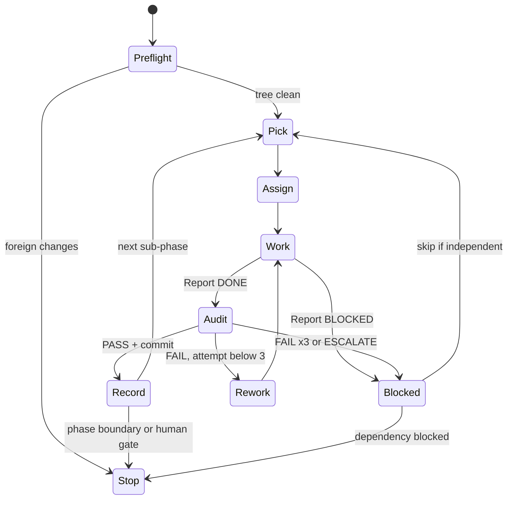

# RUN — Orchestrator for the D2DA improvement loop

> You are the **ORCHESTRATOR**. You don't write feature code and you don't commit. You:
> pick the next sub-phase → write the assignment into `agents/WORKER.md` → run the **WORKER** → run the **AUDITOR** →
> update the phase board, findings ledger, metrics and run log here → repeat, until a stop condition (§2.4).
>
> Source of truth for *what* to fix: `agents/D2DA.md`. For *how* to fix: `agents/WORKER.md`. For *acceptance*: `agents/AUDITOR.md`.

---

## 1. Who owns what

| File / section | Written by | Read by |
|---|---|---|
| `agents/D2DA.md` §6 findings (new IDs only), §9-10 | Orchestrator | all |
| `agents/WORKER.md` §4 Current Assignment, §6 cards (expand stubs, add cards) | Orchestrator | Worker, Auditor |
| `agents/WORKER.md` §5 Report | Worker | Auditor, Orchestrator |
| `agents/AUDITOR.md` §6 Last verdict, §7 Audit Log | Auditor | Orchestrator, Worker (rework) |
| `agents/RUN.md` (this file) §3-§6 | Orchestrator | all |
| Source code | Worker | Auditor |
| git commits | Auditor (only) | — |

Orchestrator edits to `agents/*.md` are committed by the Auditor in the next PASS commit (it always stages `agents/`).

## 2. The loop



### 2.1 Preflight (every cycle)
1. `git --no-optional-locks status --short`. Only allowed dirt: `agents/*`, `.antigravitycli/` (untracked, ignore). Anything else that this loop didn't create ⇒ **Stop** and ask the human (it's their work; never stash/revert it).
2. `git --no-pager log --oneline -3` — last commit is the expected one from the previous cycle.
3. `test -x /usr/libexec/mutter-devkit` is *not* required (smoke runs headless); `gnome-shell --version` must be 50.x or the version recorded in §5 — if it changed, record it in the log and run one smoke on HEAD before assigning work (a GNOME update can break things on its own).

### 2.2 Pick & Assign
1. Next unchecked row in the Phase Board (§3), respecting `Depends`.
2. If its card in `WORKER.md` §6 is a *stub*, **expand it** first into a full card (Fixes · Scope · Do · Don't · Accept · Verify · Human). Read the code (by symbol) to make Scope and Do accurate. Size it to ≤ ~300 changed lines; split into a/b/c sub-phases otherwise and add the rows to §3.
3. Overwrite `WORKER.md` §4 Current Assignment:
   ```
   Cycle:      <phase>.<n>
   Task:       <card id> — <title>
   Attempt:    1
   Card:       §6 "<card id>"
   Notes:      <context from earlier cycles, metrics to beat, things to avoid>
   ```
4. Log `ASSIGN` in §6.

### 2.3 Run the agents
Run each agent with a fresh context, so the Auditor is independent of the Worker.

- **In Zed:** use `spawn_agent` (one call at a time — never run Worker and Auditor in parallel, they share the working tree):
  - Worker — label `WORKER <task>`, message:
    `You are the WORKER. Read agents/WORKER.md fully, then agents/D2DA.md sections it references, and execute "Current Assignment". Follow the rules and procedure exactly; finish by writing the Report section in agents/WORKER.md. Project root: dash2dock-lite.`
  - Auditor — **new session every cycle**, label `AUDITOR <task>`, message:
    `You are the AUDITOR. Read agents/AUDITOR.md fully, then agents/WORKER.md (Current Assignment, the task card, Report) and agents/D2DA.md. Audit the working-tree changes for this cycle, run all gates, and either commit (PASS) or write a rework list (FAIL). Update Last verdict and append to the Audit Log. Project root: dash2dock-lite.`
  - Rework: follow up in the **Worker's existing session** with: `Audit FAILED — read agents/AUDITOR.md "Last verdict", fix every rework item, re-verify, update your Report. Attempt <k>.` Bump `Attempt:` in §4 first.
- **Manually (other tools / human-driven):** open a new chat, paste the same message, with the agent file attached.

After each agent returns, **read the file sections** (Report / Last verdict) rather than trusting the chat summary.

### 2.4 Record (after PASS)
1. Phase Board: tick the row, add commit hash.
2. Findings Ledger (§4): set each fixed ID to `fixed <hash>`; partial → `partial <hash>` + what's left.
3. Metrics (§5): copy smoke signature count, probe deltas (once R-0a lands), lint warnings (once R-0b), settings issues (once R-0c).
4. Human-check queue (§5.1): add the card's *Human* item, if any.
5. New findings reported by Worker/Auditor → add to `D2DA.md` §6 with the next free ID (`B-36`, `P-12`, …), tag `[inference]`/`[verified]`, and add a card or ledger row.
6. Log `PASS` in §6.

### 2.5 Blocked / failed
- 3 failed attempts, or ESCALATE ⇒ mark the row `BLOCKED` with reason. Save the Worker's diff: `git --no-pager diff > agents/patches/<task>-attempt<k>.patch` (create `agents/patches/`). Then restore **only that task's Scope files**: `git checkout -- <scope files>`. Never touch other files. Log it.
- Continue with the next row whose `Depends` don't include the blocked one; otherwise Stop.

### 2.6 Stop conditions (hand back to the human with a short summary)
- End of a **phase** (summary: commits, findings fixed, metrics delta, human-check queue).
- A row marked `HUMAN` (decision or visual sign-off required before continuing).
- Anything needing `sudo`, network the agent can't get, or touching the user's dconf.
- Foreign changes in the working tree; GNOME Shell version changed and HEAD smoke fails.
- 2 consecutive BLOCKED rows.

---

## 3. Phase Board

Status: `[ ]` todo · `[~]` in progress · `[x]` done (hash) · `[!]` blocked · `HUMAN` = stop for human after this row.

### Phase 0 — Safety net
| | Cycle | Task | Depends | Notes |
|---|---|---|---|---|
| [x] 861b7c1 | 0.0 | **Bootstrap commit** (Auditor only, no Worker) | — | Commit setup: `Makefile` (devkit check, flag cleanup, `check`, `smoke`), `tools/smoke-shell.sh`, `agents/*.md`, `agents/smoke-baseline*.txt`. Gates: `make check`, `make smoke`. Message `chore(agents): bootstrap agent workflow and headless smoke test`. |
| [~] | 0.1 | R-0a leak/regression probe | 0.0 | Records first leak deltas (expected ≠ 0) |
| [ ] | 0.2 | R-0b ESLint flat config | 0.0 | Needs network for `npm install` |
| [ ] | 0.3 | R-0c settings checker | 0.0 | Must flag B-12, B-16 |
| [ ] | 0.4 | R-0d release via `gnome-extensions pack` | 0.0 | HUMAN — end of phase 0 |

### Phase 1 — Correctness quick wins
| | Cycle | Task | Depends | Notes |
|---|---|---|---|---|
| [ ] | 1.1 | R-1 harden Timer | 0.1 | B-2, B-23, B-6(timer), B-24(typo) |
| [ ] | 1.2 | R-2 reset `*Seq` + listeners | 1.1 | B-6, B-7 |
| [ ] | 1.3 | R-3 autohide | 1.1 | B-3, B-4, B-26, B-27 · human visual |
| [ ] | 1.4 | R-4a extension.js one-liners | 0.3 | B-5, B-13, B-16, B-20 |
| [ ] | 1.5 | R-4b animator one-liners | 0.1 | B-14, B-15, B-34 · human visual |
| [ ] | 1.6 | R-4c dock.js input | 0.1 | B-17, B-18, B-19 · human visual |
| [ ] | 1.7 | R-4d mount names | 0.1 | B-9 |
| [ ] | 1.8 | R-6 remove eval | 0.1 | B-11 |
| [ ] | 1.9 | R-5 prefs | 0.3, 1.8 | B-12, B-32, B-33 · human visual |
| [ ] | 1.10 | B-35 NaN clip (BMS) | 0.1 | G-real required · HUMAN — end of phase 1 |

### Phase 2 — Lifecycle (G1) — expand stubs before assigning
| | Cycle | Task | Depends | Notes |
|---|---|---|---|---|
| [ ] | 2.1 | R-7a animator teardown | 1.2 | |
| [ ] | 2.2 | R-7b menus/lists/clock/calendar destroy | 2.1 | B-29 |
| [ ] | 2.3 | R-7c WindowTracker, no Meta.Window expandos | 1.3 | B-31 |
| [ ] | 2.4 | R-7d Dock.destroy + destroyDocks | 2.1-2.3 | B-1 · then turn **strict leaks ON** (§5) |
| [ ] | 2.5 | R-8 services cancellables / dt | 2.4 | B-25 |
| [ ] | 2.6 | R-9a trash via Gio | 2.5 | B-8 · human visual |
| [ ] | 2.7 | R-9b launchers in memory | 2.5 | B-10 |
| [ ] | 2.8 | R-9c XDG paths | 2.5 | B-22 |
| [ ] | 2.9 | R-9d CSS without /tmp | 2.5 | HUMAN — end of phase 2 |

### Phase 3 — Speed (G2)
| | Cycle | Task | Depends | Notes |
|---|---|---|---|---|
| [ ] | 3.1 | R-10 dirty-flag `relayout()` | 2.4 | P-1 · human visual |
| [ ] | 3.2 | R-11a frame-clock driver | 3.1 | P-2 · human visual |
| [ ] | 3.3 | R-11b exact debounces | 3.2 | B-24 |
| [ ] | 3.4 | R-11c drop `animation-fps` hack | 3.3 | |
| [ ] | 3.5 | R-12 allocation-free animator (split per P-id) | 3.1 | P-3..P-7, P-11 |
| [ ] | 3.6 | R-13 async services, notification signals, shader cache | 2.5 | P-9, P-10 · HUMAN — end of phase 3 |

### Phase 4 — GNOME-update resilience (G3)
| | Cycle | Task | Depends | Notes |
|---|---|---|---|---|
| [ ] | 4.1 | R-14a compat.js skeleton + C1/C4 | 2.4 | |
| [ ] | 4.2 | R-14b C2/C3 icon parts, activate | 4.1 | |
| [ ] | 4.3 | R-15 public APIs (C5-C8, C10, C17) | 4.1 | |
| [ ] | 4.4 | R-14c C11-C18 | 4.1 | |
| [ ] | 4.5 | R-16 DockModel evaluation | 4.4 | HUMAN decision before any code |

### Phase 5 — Elegance (G4)
| | Cycle | Task | Depends | Notes |
|---|---|---|---|---|
| [ ] | 5.1 | R-17 settings reactions as data | 4.3 | |
| [ ] | 5.2 | R-18 effects base, prune helpers | 3.5 | |
| [ ] | 5.3 | R-19 module renames / moves | 5.1 | |
| [ ] | 5.4 | R-20 keys from schema, dead keys | 0.3 | HUMAN OK for key removal |
| [ ] | 5.5 | R-21 delete obsolete files, README | 0.4 | HUMAN — end of phase 5 |

## 4. Findings Ledger

Status: `open` · `fixed <hash>` · `partial <hash>` · `blocked` · `wontfix (reason)`.

| ID | Task | Status | | ID | Task | Status |
|---|---|---|---|---|---|---|
| B-1 | R-7d | open | | B-19 | R-4c | open |
| B-2 | R-1 | open | | B-20 | R-4a | open |
| B-3 | R-3 | open | | B-21 | R-8 | open |
| B-4 | R-3 | open | | B-22 | R-9c | open |
| B-5 | R-4a | open | | B-23 | R-1 | open |
| B-6 | R-1, R-2 | open | | B-24 | R-1, R-11b | open |
| B-7 | R-2 | open | | B-25 | R-8 | open |
| B-8 | R-9a | open | | B-26 | R-3 | open |
| B-9 | R-4d | open | | B-27 | R-3 | open |
| B-10 | R-9b | open | | B-28 | (unassigned, needs St case check) | open |
| B-11 | R-6 | open | | B-29 | R-7b | open |
| B-12 | R-5 | open | | B-30 | (unassigned) | open |
| B-13 | R-4a | open | | B-31 | R-7c | open |
| B-14 | R-4b | open | | B-32 | R-5 | open |
| B-15 | R-4b | open | | B-33 | R-5 | open |
| B-16 | R-4a | open | | B-34 | R-4b | open |
| B-17 | R-4c | open | | B-35 | B-35 | open |
| B-18 | R-4c | open | | T-4 | R-0d | open |
| P-1 | R-10 | open | | P-7 | R-12 | open |
| P-2 | R-11a | open | | P-8 | (unassigned, BMS) | open |
| P-3..P-6 | R-12 | open | | P-9, P-10 | R-13 | open |
| P-11 | R-12 | open | | §6.3 low bugs | batch after phase 1 | open |

Unassigned rows: when a phase ends, either add a card + board row for them or mark `wontfix (reason)`.

## 5. Metrics & environment

| Metric | Value | At |
|---|---|---|
| GNOME Shell | 50.5 (Fedora 44) | setup |
| Smoke baseline (isolated) | 1 signature (NM GI warning — shell side, not ours) | setup |
| Smoke baseline (real dconf, advisory) | 4 signatures (incl. B-35, search-light's DesktopAppInfo warning) | setup |
| Probe leak deltas after N toggles (uiGroup / stage / dashes / hi / lo / loop) | — (R-0a) | |
| Strict leaks (`D2DA_SMOKE_STRICT_LEAKS=1` in G-leaks) | **OFF** (turn ON after 2.4) | |
| ESLint warnings | — (R-0b) | |
| check-settings issues | — (R-0c) | |

### 5.1 Human-check queue
Items the agents can't see. The human runs `make test-shell` (needs `mutter-devkit`) or uses their real session, then ticks them here.

| Cycle | Commit | What to check | OK? |
|---|---|---|---|
| | | | |

## 6. Run Log (append-only, newest last)

Format: `YYYY-MM-DD HH:MM · cycle · EVENT · details` where EVENT ∈ `SETUP, PREFLIGHT, ASSIGN, WORK, AUDIT-PASS, AUDIT-FAIL, REWORK, BLOCKED, ESCALATE, STOP, HUMAN, NOTE`.

- 2026-10-04 · — · SETUP · `make test-shell` fixed (missing `mutter-devkit` ⇒ guard + flag cleanup in Makefile). Added `tools/smoke-shell.sh` (headless nested shell, isolated memory GSettings, error-signature baseline), `make check`, `make smoke`, baselines in `agents/smoke-baseline*.txt`. New finding B-35 (NaN `clip`, BMS path). Created WORKER/AUDITOR/RUN docs. Nothing committed yet.
- 2026-10-04 · 0.0 · NOTE · Next: Auditor-only bootstrap commit (Phase Board 0.0), then assign 0.1 R-0a (already pre-filled in WORKER.md §4).
- 2026-10-04 · 0.0 · PREFLIGHT · dirt = `Makefile`, `tools/smoke-shell.sh`, `agents/` (all from SETUP); HEAD `f876684`; GNOME Shell 50.5 (unchanged).
- 2026-10-04 · 0.0 · ASSIGN · Auditor-only bootstrap commit.
- 2026-10-04 · 0.0 · AUDIT-PASS · `861b7c1` check=PASS smoke=PASS(x2). Nits: trailing whitespace in WORKER.md Report template; smoke log at fixed `/tmp/d2da-smoke.log` (dev-only); `make install` copies `agents/` into installed extension (publish strips it). Candidate for R-0d.
- 2026-10-04 · 0.1 · ASSIGN · R-0a leak/regression probe (card already full).
- 2026-10-04 · 0.1 · WORK · Report DONE: `probe.js` (new), `extension.js`, `tools/smoke-shell.sh`. check OK, smoke PASS, probe lines 6/5. Deltas after-disable: uiGroup 0, stage 0, dashes 0, docks 0, hi 0, lo +1, loop 0. Worker notes: (a) `lo` +1 is a smoke-timing artifact (4 s before 1st disable vs 1 s later) ⇒ must fix before strict leaks ON; (b) stage-walk deltas can't see B-1 (off-stage leaks) ⇒ R-7d needs a live Dock/Dash instance counter. Not yet audited.
- 2026-10-04 · 0.1 · STOP · Foreign change found before audit: `README.md` **staged** in the index (AI-maintenance announcement + GNOME 50 support line). Not created by this loop. Auditor not run, because a commit would include it. Waiting for the human: commit it separately, or unstage it (`git restore --staged README.md`), then resume with the 0.1 AUDIT.
- 2026-10-04 · 0.1 · PREFLIGHT · Human committed `888baf5 Readme updated`, which also included the unaudited R-0a code (`extension.js`, `tools/smoke-shell.sh`) and Orchestrator edits to `agents/RUN.md`, `agents/WORKER.md`. `probe.js` was left untracked ⇒ HEAD imports a file that isn't in git. No history rewrite. Auditor will audit the range `861b7c1..HEAD` (code files) + untracked `probe.js`; its PASS commit adds `probe.js` and completes R-0a. GNOME Shell 50.5.
- 2026-10-04 · 0.1 · NOTE · Orchestrator edit tool can't match text in RUN.md (stale editor buffer?); appending log lines via shell.
