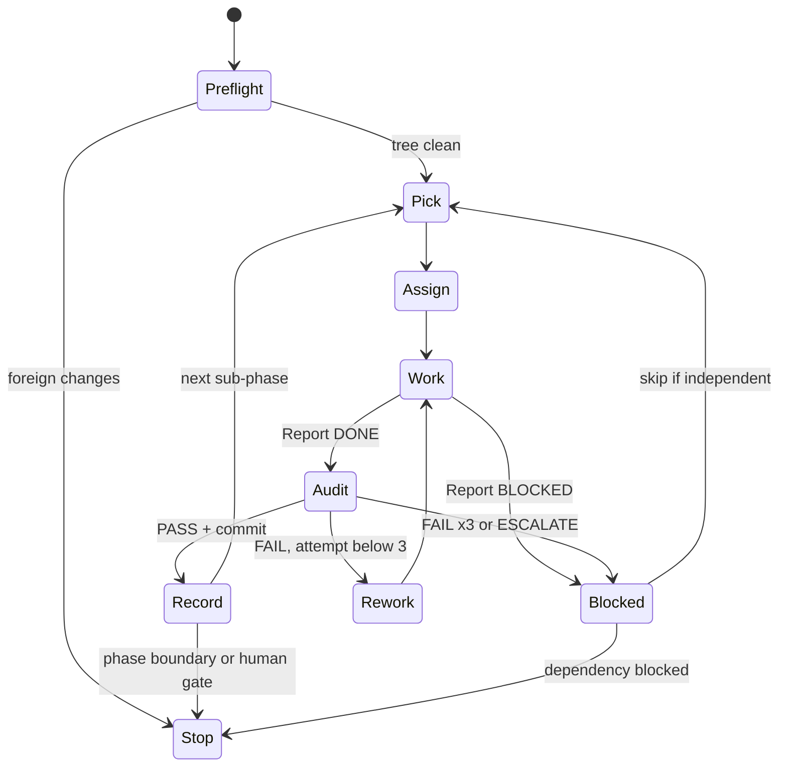

# RUN — Orchestrator for the D2DA improvement loop

> You are the **ORCHESTRATOR**. You don't write feature code and you don't commit. You:
> pick the next sub-phase → write the assignment into `agents/WORKER.md` → run the **WORKER** → run the **AUDITOR** →
> update the phase board, findings ledger, metrics and run log here → repeat, until a stop condition (§2.4).
>
> Source of truth for *what* to fix: `agents/D2DA.md`. For *how* to fix: `agents/WORKER.md`. For *acceptance*: `agents/AUDITOR.md`.

---

## 1. Who owns what

| File / section | Written by | Read by |
|---|---|---|
| `agents/D2DA.md` §6 findings (new IDs only), §9-10 | Orchestrator | all |
| `agents/WORKER.md` §4 Current Assignment, §6 cards (expand stubs, add cards) | Orchestrator | Worker, Auditor |
| `agents/WORKER.md` §5 Report | Worker | Auditor, Orchestrator |
| `agents/AUDITOR.md` §6 Last verdict, §7 Audit Log | Auditor | Orchestrator, Worker (rework) |
| `agents/RUN.md` (this file) §3-§6 | Orchestrator | all |
| Source code | Worker | Auditor |
| git commits | Auditor (only) | — |

Orchestrator edits to `agents/*.md` are committed by the Auditor in the next PASS commit (it always stages `agents/`).

## 2. The loop



### 2.1 Preflight (every cycle)
1. `git --no-optional-locks status --short`. Only allowed dirt: `agents/*`, `.antigravitycli/` (untracked, ignore). Anything else that this loop didn't create ⇒ **Stop** and ask the human (it's their work; never stash/revert it).
2. `git --no-pager log --oneline -3` — last commit is the expected one from the previous cycle.
3. `test -x /usr/libexec/mutter-devkit` is *not* required (smoke runs headless); `gnome-shell --version` must be 50.x or the version recorded in §5 — if it changed, record it in the log and run one smoke on HEAD before assigning work (a GNOME update can break things on its own).

### 2.2 Pick & Assign
1. Next unchecked row in the Phase Board (§3), respecting `Depends`.
2. If its card in `WORKER.md` §6 is a *stub*, **expand it** first into a full card (Fixes · Scope · Do · Don't · Accept · Verify · Human). Read the code (by symbol) to make Scope and Do accurate. Size it to ≤ ~300 changed lines; split into a/b/c sub-phases otherwise and add the rows to §3.
3. Overwrite `WORKER.md` §4 Current Assignment:
   ```
   Cycle:      <phase>.<n>
   Task:       <card id> — <title>
   Attempt:    1
   Card:       §6 "<card id>"
   Notes:      <context from earlier cycles, metrics to beat, things to avoid>
   ```
4. Log `ASSIGN` in §6.

### 2.3 Run the agents
Run each agent with a fresh context, so the Auditor is independent of the Worker.

- **In Zed:** use `spawn_agent` (one call at a time — never run Worker and Auditor in parallel, they share the working tree):
  - Worker — label `WORKER <task>`, message:
    `You are the WORKER. Read agents/WORKER.md fully, then agents/D2DA.md sections it references, and execute "Current Assignment". Follow the rules and procedure exactly; finish by writing the Report section in agents/WORKER.md. Project root: dash2dock-lite.`
  - Auditor — **new session every cycle**, label `AUDITOR <task>`, message:
    `You are the AUDITOR. Read agents/AUDITOR.md fully, then agents/WORKER.md (Current Assignment, the task card, Report) and agents/D2DA.md. Audit the working-tree changes for this cycle, run all gates, and either commit (PASS) or write a rework list (FAIL). Update Last verdict and append to the Audit Log. Project root: dash2dock-lite.`
  - Rework: follow up in the **Worker's existing session** with: `Audit FAILED — read agents/AUDITOR.md "Last verdict", fix every rework item, re-verify, update your Report. Attempt <k>.` Bump `Attempt:` in §4 first.
- **Manually (other tools / human-driven):** open a new chat, paste the same message, with the agent file attached.

After each agent returns, **read the file sections** (Report / Last verdict) rather than trusting the chat summary.

### 2.4 Record (after PASS)
1. Phase Board: tick the row, add commit hash.
2. Findings Ledger (§4): set each fixed ID to `fixed <hash>`; partial → `partial <hash>` + what's left.
3. Metrics (§5): copy smoke signature count, probe deltas (once R-0a lands), lint warnings (once R-0b), settings issues (once R-0c).
4. Human-check queue (§5.1): add the card's *Human* item, if any.
5. New findings reported by Worker/Auditor → add to `D2DA.md` §6 with the next free ID (`B-36`, `P-12`, …), tag `[inference]`/`[verified]`, and add a card or ledger row.
6. Log `PASS` in §6.

### 2.5 Blocked / failed
- 3 failed attempts, or ESCALATE ⇒ mark the row `BLOCKED` with reason. Save the Worker's diff: `git --no-pager diff > agents/patches/<task>-attempt<k>.patch` (create `agents/patches/`). Then restore **only that task's Scope files**: `git checkout -- <scope files>`. Never touch other files. Log it.
- Continue with the next row whose `Depends` don't include the blocked one; otherwise Stop.

### 2.6 Stop conditions (hand back to the human with a short summary)
- End of a **phase** (summary: commits, findings fixed, metrics delta, human-check queue).
- A row marked `HUMAN` (decision or visual sign-off required before continuing).
- Anything needing `sudo`, network the agent can't get, or touching the user's dconf.
- Foreign changes in the working tree; GNOME Shell version changed and HEAD smoke fails.
- 2 consecutive BLOCKED rows.

---

## 3. Phase Board

Status: `[ ]` todo · `[~]` in progress · `[x]` done (hash) · `[!]` blocked · `HUMAN` = stop for human after this row.

### Phase 0 — Safety net
| | Cycle | Task | Depends | Notes |
|---|---|---|---|---|
| [x] 861b7c1 | 0.0 | **Bootstrap commit** (Auditor only, no Worker) | — | Commit setup: `Makefile` (devkit check, flag cleanup, `check`, `smoke`), `tools/smoke-shell.sh`, `agents/*.md`, `agents/smoke-baseline*.txt`. Gates: `make check`, `make smoke`. Message `chore(agents): bootstrap agent workflow and headless smoke test`. |
| [x] 2bbf52d | 0.1 | R-0a leak/regression probe | 0.0 | Records first leak deltas (expected ≠ 0) |
| [x] 2a0ae6f | 0.2 | R-0b ESLint flat config | 0.0 | Needs network for `npm install` |
| [x] cff438d | 0.3 | R-0c settings checker | 0.0 | Must flag B-12, B-16 |
| SKIPPED | 0.4 | R-0d release via `gnome-extensions pack` | 0.0 | Human 2026-10-04: no release for now. Card kept for later. End of phase 0 |

### Phase 1 — Correctness quick wins
| | Cycle | Task | Depends | Notes |
|---|---|---|---|---|
| [x] ef879f9 | 1.1 | R-1 harden Timer | 0.1 | B-2, B-23, B-6(timer), B-24(typo) |
| [x] c84f252 | 1.2 | R-2 reset `*Seq` + listeners | 1.1 | B-6, B-7 |
| [x] dda62a5 | 1.3 | R-3 autohide | 1.1 | B-3, B-4, B-26, B-27 · human visual |
| [x] c9ca876 | 1.4 | R-4a extension.js one-liners | 0.3 | B-5, B-13, B-16, B-20 |
| [x] 8f44419 | 1.5 | R-4b animator one-liners | 0.1 | B-14, B-15, B-34 · human visual |
| [x] 1b03ca7 | 1.6 | R-4c dock.js input | 0.1 | B-17, B-18, B-19 · human visual |
| [x] 0821a56 | 1.7 | R-4d mount names | 0.1 | B-9 |
| [x] 3311461 | 1.8 | R-6 remove eval | 0.1 | B-11 |
| [x] 5840f29 | 1.9 | R-5 prefs | 0.3, 1.8 | B-12, B-32, B-33 · human visual |
| SKIPPED | 1.10 | B-35 NaN clip (BMS) — human 2026-10-04: skip for now (needs real-dconf smoke) | 0.1 | G-real required · HUMAN — end of phase 1 |
| [~] | 1.11 | Restore prefs diagnostics access (human request, Auditor-only; Orchestrator made the edits during the pause) | 1.8 | `prefs.js` toggle_experimental reads `experimental-features`; `ui/general.ui` experimental-features-row visible |

### Phase 2 — Lifecycle (G1) — expand stubs before assigning
| | Cycle | Task | Depends | Notes |
|---|---|---|---|---|
| [ ] | 2.1 | R-7a animator teardown | 1.2 | |
| [ ] | 2.2 | R-7b menus/lists/clock/calendar destroy | 2.1 | B-29 |
| [ ] | 2.3 | R-7c WindowTracker, no Meta.Window expandos | 1.3 | B-31 |
| [ ] | 2.3a | R-0e probe v2 (smoke timing, live-instance counters) | 0.1 | T-5, T-6 · prerequisite for strict leaks |
| [ ] | 2.4 | R-7d Dock.destroy + destroyDocks | 2.1-2.3a | B-1 · then turn **strict leaks ON** (§5) |
| [ ] | 2.5 | R-8 services cancellables / dt | 2.4 | B-25 |
| [ ] | 2.6 | R-9a trash via Gio | 2.5 | B-8 · human visual |
| [ ] | 2.7 | R-9b launchers in memory | 2.5 | B-10 |
| [ ] | 2.8 | R-9c XDG paths | 2.5 | B-22 |
| [ ] | 2.9 | R-9d CSS without /tmp | 2.5 | HUMAN — end of phase 2 |

### Phase 3 — Speed (G2)
| | Cycle | Task | Depends | Notes |
|---|---|---|---|---|
| [ ] | 3.1 | R-10 dirty-flag `relayout()` | 2.4 | P-1 · human visual |
| [ ] | 3.2 | R-11a frame-clock driver | 3.1 | P-2 · human visual |
| [ ] | 3.3 | R-11b exact debounces | 3.2 | B-24 |
| [ ] | 3.4 | R-11c drop `animation-fps` hack | 3.3 | |
| [ ] | 3.5 | R-12 allocation-free animator (split per P-id) | 3.1 | P-3..P-7, P-11 |
| [ ] | 3.6 | R-13 async services, notification signals, shader cache | 2.5 | P-9, P-10 · HUMAN — end of phase 3 |

### Phase 4 — GNOME-update resilience (G3)
| | Cycle | Task | Depends | Notes |
|---|---|---|---|---|
| [ ] | 4.1 | R-14a compat.js skeleton + C1/C4 | 2.4 | |
| [ ] | 4.2 | R-14b C2/C3 icon parts, activate | 4.1 | |
| [ ] | 4.3 | R-15 public APIs (C5-C8, C10, C17) | 4.1 | |
| [ ] | 4.4 | R-14c C11-C18 | 4.1 | |
| [ ] | 4.5 | R-16 DockModel evaluation | 4.4 | HUMAN decision before any code |

### Phase 5 — Elegance (G4)
| | Cycle | Task | Depends | Notes |
|---|---|---|---|---|
| [ ] | 5.1 | R-17 settings reactions as data | 4.3 | |
| [ ] | 5.2 | R-18 effects base, prune helpers | 3.5 | |
| [ ] | 5.3 | R-19 module renames / moves | 5.1 | |
| [ ] | 5.4 | R-20 keys from schema, dead keys | 0.3 | HUMAN OK for key removal |
| [ ] | 5.5 | R-21 delete obsolete files, README | 0.4 (skipped; re-check before 5.5) | HUMAN — end of phase 5 |

## 4. Findings Ledger

Status: `open` · `fixed <hash>` · `partial <hash>` · `blocked` · `wontfix (reason)`.

| ID | Task | Status | | ID | Task | Status |
|---|---|---|---|---|---|---|
| B-1 | R-7d | open | | B-19 | R-4c | fixed 1b03ca7 |
| B-2 | R-1 | fixed ef879f9 | | B-20 | R-4a | fixed c9ca876 |
| B-3 | R-3 | fixed dda62a5 (defensive guard only; premise wrong, see D2DA) | | B-21 | R-8 | open |
| B-4 | R-3 | fixed dda62a5 | | B-22 | R-9c | open |
| B-5 | R-4a | fixed c9ca876 | | B-23 | R-1 | fixed ef879f9 |
| B-6 | R-1, R-2 | fixed ef879f9 + c84f252 | | B-24 | R-1, R-11b | partial ef879f9 (`typeof func` typo; resolution collapse in R-11b) |
| B-7 | R-2 | fixed c84f252 | | B-25 | R-8 | open |
| B-8 | R-9a | open | | B-26 | R-3 | fixed dda62a5 (dead check removed per human rule) |
| B-9 | R-4d | fixed 0821a56 | | B-27 | R-3 | fixed dda62a5 |
| B-10 | R-9b | open | | B-28 | (unassigned, needs St case check) | open |
| B-11 | R-6 | fixed 3311461 | | B-29 | R-7b | open |
| B-12 | R-5 | fixed 5840f29 | | B-30 | (unassigned) | open |
| B-13 | R-4a | fixed c9ca876 | | B-31 | R-7c | open |
| B-14 | R-4b | fixed 8f44419 | | B-32 | R-5 | fixed 5840f29 |
| B-15 | R-4b | fixed 8f44419 | | B-33 | R-5 | fixed 5840f29 |
| B-16 | R-4a | fixed c9ca876 | | B-34 | R-4b | fixed 8f44419 |
| B-17 | R-4c | fixed 1b03ca7 | | B-35 | B-35 | deferred (needs real-dconf / BMS test) |
| B-18 | R-4c | fixed 1b03ca7 | | T-4 | R-0d | deferred (no release for now) |
| P-1 | R-10 | open | | P-7 | R-12 | open |
| P-2 | R-11a | open | | P-8 | (unassigned, BMS) | open |
| P-3..P-6 | R-12 | open | | P-9, P-10 | R-13 | open |
| P-11 | R-12 | open | | §6.3 low bugs | batch after phase 1 | open |
| T-5 | R-0e | open | | T-6 | R-0e | open |
| B-36 | R-8 | open | | B-37 | R-9d | open |
| T-7 | R-0b, R-0d | partial 2a0ae6f (interim rm lines; dev docs still installed; R-0d pack list must exclude `eslint.config.js`) | | | | |

Unassigned rows: when a phase ends, either add a card + board row for them or mark `wontfix (reason)`.

## 5. Metrics & environment

| Metric | Value | At |
|---|---|---|
| GNOME Shell | 50.5 (Fedora 44) | setup |
| Smoke baseline (isolated) | 1 signature (NM GI warning — shell side, not ours) | setup |
| Smoke baseline (real dconf, advisory) | 4 signatures (incl. B-35, search-light's DesktopAppInfo warning) | setup |
| Probe after-disable deltas, 5 toggles (uiGroup / stage / dashes / docks / hi / lo / loop) | 0 / 0 / 0 / 0 / 0 / **+1** / 0. `lo` +1 = smoke-timing artifact (T-5). Stage-walk can't see B-1 (T-6). Absolute `stage` varies per run (2865-2885) ⇒ track deltas only | 2bbf52d |
| Strict leaks (`D2DA_SMOKE_STRICT_LEAKS=1` in G-leaks) | **OFF** (turn ON after 2.4) | |
| ESLint warnings (errors) | 151 (0) at 5840f29; 154 at 0821a56; 158 at 1b03ca7; 162 at c9ca876; 166 at ef879f9; 168 at 2a0ae6f. no-unused-vars 162, no-undef 5, no-duplicate-case 1; only remaining demotion: `no-undef: warn` in extension.js for the dead `_onKeyPressed` Clutter use (delete in R-18/R-21) | 2a0ae6f |
| check-settings issues | **5840f29: exit 0, 0 errors / 30 warnings ⇒ G-settings is now a hard gate (must exit 0).** c9ca876: 1 error (B-12) / 30 warnings. At cff438d: exit 1 by design. Errors 2: shared-adjustment 1 (B-12), duplicate-case 1 (B-16); missing-in-schema 0, widget-type 0. Warnings 30: missing-in-keys 5, key-no-widget 8, dead-setting 17 (§6.5 list + `msg-to-ext` false positive). Should exit 0 after R-4a + R-5 ⇒ then make G-settings a hard exit-code gate | cff438d |

### 5.1 Human-check queue
Items the agents can't see. The human runs `make test-shell` (needs `mutter-devkit`) or uses their real session, then ticks them here.

| Cycle | Commit | What to check | OK? |
|---|---|---|---|
| 1.3 | dda62a5 | Autohide + dodge on a bottom and a top dock | |
| 1.3 | dda62a5 | Top dock, pressure sense on: pushing at the top edge reveals it; bottom edge does nothing | |
| 1.3 | dda62a5 | Dialog / utility window over the dock ⇒ dock dodges | |
| 1.3 | dda62a5 | X11 + desktop icons: dock not stuck hidden | |
| 1.3 | dda62a5 | Hidden dock, pointer parked over its area, click another window ⇒ stays hidden (reveal only via 2px edge) | |
| 1.3 | dda62a5 | Shown dock, pointer resting on it while a window overlaps ⇒ never hides | |
| 1.4 | c9ca876 | Log in with the extension on, disable it, open overview ⇒ dash icons + show-apps visible | |
| 1.4 | c9ca876 | Change icon size in prefs ⇒ dock resizes, shrink still applies | |
| 1.5 | 8f44419 | Hover magnify settles without jitter; separators stay in place | |
| 1.5 | 8f44419 | Animation FPS Medium/Low: icons snap to magnified positions (intended) and look right | |
| 1.5 | 8f44419 | Launch from a left and a right dock: after the bounce the icon returns fully to its column | |
| 1.6 | 1b03ca7 | Running app: click (raise/minimize), shift-click, middle-click (new window), ctrl-click | |
| 1.6 | 1b03ca7 | Ctrl+scroll over an icon cycles only current-workspace windows | |
| 1.6 | 1b03ca7 | Tint/monochrome icon effect on, then disable extension ⇒ effect gone | |
| 1.7 | 0821a56 | Two USB sticks (same label) ⇒ two icons with real names; unmount one removes only it; remount/rename updates label | |
| 1.8 | 3311461 | Prefs → diagnostics / self-test button still runs diagnostics | |
| 1.9 | 5840f29 | `make test-prefs`: `dconf dump /org/gnome/shell/extensions/dash2dock-lite/` identical before/after open+close, preferred monitor ≠ first (a new `msg-to-ext=''` line is a known nit) | |
| 1.9 | 5840f29 | Pressure and scroll sliders move independently | |
| 1.9 | 5840f29 | Reset and a theme preset update the widgets, incl. colors | |
| 1.9 | 5840f29 | Cancel the downloads-folder dialog ⇒ old path kept; monitor dropdown shows the saved monitor | |

## 6. Run Log (append-only, newest last)

Format: `YYYY-MM-DD HH:MM · cycle · EVENT · details` where EVENT ∈ `SETUP, PREFLIGHT, ASSIGN, WORK, AUDIT-PASS, AUDIT-FAIL, REWORK, BLOCKED, ESCALATE, STOP, HUMAN, NOTE`.

- 2026-10-04 · — · SETUP · `make test-shell` fixed (missing `mutter-devkit` ⇒ guard + flag cleanup in Makefile). Added `tools/smoke-shell.sh` (headless nested shell, isolated memory GSettings, error-signature baseline), `make check`, `make smoke`, baselines in `agents/smoke-baseline*.txt`. New finding B-35 (NaN `clip`, BMS path). Created WORKER/AUDITOR/RUN docs. Nothing committed yet.
- 2026-10-04 · 0.0 · NOTE · Next: Auditor-only bootstrap commit (Phase Board 0.0), then assign 0.1 R-0a (already pre-filled in WORKER.md §4).
- 2026-10-04 · 0.0 · PREFLIGHT · dirt = `Makefile`, `tools/smoke-shell.sh`, `agents/` (all from SETUP); HEAD `f876684`; GNOME Shell 50.5 (unchanged).
- 2026-10-04 · 0.0 · ASSIGN · Auditor-only bootstrap commit.
- 2026-10-04 · 0.0 · AUDIT-PASS · `861b7c1` check=PASS smoke=PASS(x2). Nits: trailing whitespace in WORKER.md Report template; smoke log at fixed `/tmp/d2da-smoke.log` (dev-only); `make install` copies `agents/` into installed extension (publish strips it). Candidate for R-0d.
- 2026-10-04 · 0.1 · ASSIGN · R-0a leak/regression probe (card already full).
- 2026-10-04 · 0.1 · WORK · Report DONE: `probe.js` (new), `extension.js`, `tools/smoke-shell.sh`. check OK, smoke PASS, probe lines 6/5. Deltas after-disable: uiGroup 0, stage 0, dashes 0, docks 0, hi 0, lo +1, loop 0. Worker notes: (a) `lo` +1 is a smoke-timing artifact (4 s before 1st disable vs 1 s later) ⇒ must fix before strict leaks ON; (b) stage-walk deltas can't see B-1 (off-stage leaks) ⇒ R-7d needs a live Dock/Dash instance counter. Not yet audited.
- 2026-10-04 · 0.1 · STOP · Foreign change found before audit: `README.md` **staged** in the index (AI-maintenance announcement + GNOME 50 support line). Not created by this loop. Auditor not run, because a commit would include it. Waiting for the human: commit it separately, or unstage it (`git restore --staged README.md`), then resume with the 0.1 AUDIT.
- 2026-10-04 · 0.1 · PREFLIGHT · Human committed `888baf5 Readme updated`, which also included the unaudited R-0a code (`extension.js`, `tools/smoke-shell.sh`) and Orchestrator edits to `agents/RUN.md`, `agents/WORKER.md`. `probe.js` was left untracked ⇒ HEAD imports a file that isn't in git. No history rewrite. Auditor will audit the range `861b7c1..HEAD` (code files) + untracked `probe.js`; its PASS commit adds `probe.js` and completes R-0a. GNOME Shell 50.5.
- 2026-10-04 · 0.1 · NOTE · Orchestrator edit tool can't match text in RUN.md (stale editor buffer?); appending log lines via shell.
- 2026-10-04 · 0.1 · AUDIT-PASS · `2bbf52d` (adds `probe.js`; extension.js/smoke-shell.sh parts landed in `888baf5`). check=PASS smoke=PASS(x2) card=PASS (probe off ⇒ 0 lines; strict ⇒ FAIL on lo +1 as designed). Metrics recorded in §5.
- 2026-10-04 · 0.1 · NOTE · New findings T-5 (smoke wait asymmetry, strict doesn't enforce probe line count) and T-6 (stage-walk can't see off-stage leaks) added to D2DA §6.6 → new card R-0e (board row 2.3a, before R-7d). R-7d Accept now requires live-instance counters. R-0d card: keep `probe.js` in zip; `install` stops copying `agents/` etc.
- 2026-10-04 · 0.2 · PREFLIGHT · tree = only agents/* Orchestrator edits; HEAD `2bbf52d`; GNOME Shell 50.5; network + npm OK.
- 2026-10-04 · 0.2 · ASSIGN · R-0b ESLint flat config (scope + `package-lock.json`, `lint/`, `.eslintrc.yml`).
- 2026-10-04 · 0.2 · WORK · Report DONE: `eslint.config.js` (new), `package.json` (`type: module`, eslint/@eslint/js ^9, `lint` script), `package-lock.json`, Makefile `lint` → `npx eslint .`, deleted `.eslintrc.yml` + `lint/`. 0 errors / 168 warnings (no-unused-vars 162, no-undef 5, no-duplicate-case 1). Known-bug rules demoted only in `extension.js`/`timer.js` (B-5, B-16, §6.3 Clutter, B-24); restore in R-4a / R-1. Skipped `globals` dep (unused). New: T-7 `make install` copies `node_modules/` (14 MB), `eslint.config.js`, `package*.json`, `agents/` into the installed extension; `publish` would ship `eslint.config.js` ⇒ R-0d.
- 2026-10-04 · 0.2 · ESCALATE · Auditor: R-0b passes all gates (check OK, lint 0 err/168 warn, smoke PASS x2), but `Makefile` changed at 10:26:51 during the audit. Two foreign lines (`rm -rf …/extensions/<uuid>/node_modules` in `install`, `rm -rf build/node_modules` in `publish`), not written by Worker, Auditor or Orchestrator. Nothing committed, index cleared.
- 2026-10-04 · 0.2 · STOP · Waiting for the human: (a) revert those 2 lines ⇒ Auditor re-runs and commits R-0b; or (b) keep them and the Orchestrator adds them to R-0b scope (interim T-7 fix; R-0d replaces it with `gnome-extensions pack`) ⇒ re-audit.
- 2026-10-04 · 0.2 · HUMAN · Human chose option (b): keep the 2 `node_modules` rm lines. Added to R-0b scope with the T-7 interim fix (install drops agents/, eslint.config.js, package*.json; publish drops eslint.config.js; `lint` in .PHONY).
- 2026-10-04 · 0.2 · REWORK · Attempt 2 sent to the Worker session (Makefile only).
- 2026-10-04 · 0.2 · AUDIT-PASS · `2a0ae6f` attempt 2. check=PASS lint=0 err/168 warn smoke=PASS(x2); publish verified in a temp copy (no eslint.config.js/node_modules/agents/package*.json; `themes/` missing = T-4). T-7 filed (D2DA §6.6), partial; R-0d card extended (allow-list install, exclude `eslint.config.js` and dev docs, handle spaces in filenames).
- 2026-10-04 · 0.3 · PREFLIGHT · tree = only agents/* Orchestrator edits; HEAD `2a0ae6f`; GNOME Shell 50.5.
- 2026-10-04 · 0.3 · ASSIGN · R-0c settings consistency checker.
- 2026-10-04 · 0.3 · AUDIT-PASS · `cff438d`. check=PASS lint=0/168 settings=exit 1 (2 err/30 warn baseline) smoke=PASS(x2). Auditor confirmed B-12/B-16 hits by reading code, negative test (both fixed in a scratch copy ⇒ exit 0), and spot-checked dead settings. D2DA §6.5 corrected (`animation-type`, `documents-path` are in keys.js too).
- 2026-10-04 · 0.4 · HUMAN · Human: skip R-0d, no release for now. Row 0.4 marked SKIPPED; T-4 deferred, T-7 stays partial (interim rm lines from 2a0ae6f). R-21's dependency on 0.4 is noted. Removed loop artifact `tools/__pycache__/` (gitignore was planned in R-0d).
- 2026-10-04 · 0.4 · STOP · End of phase 0. Waiting for the human to start phase 1 (1.1 R-1 harden Timer).
- 2026-10-04 · 1.1 · PREFLIGHT · tree = only agents/* Orchestrator edits; HEAD `cff438d`; GNOME Shell 50.5; gjs 1.88.1.
- 2026-10-04 · 1.1 · ASSIGN · R-1 harden Timer (scope + `eslint.config.js`: drop timer.js from the no-undef demotion after the B-24 typo fix).
- 2026-10-04 · 1.1 · AUDIT-PASS · `ef879f9`. check=PASS lint=0/166 (−2) settings=2/30 smoke=PASS(x2) timer_check 15/15 (fails on HEAD~ timer.js). Worker departures accepted: direct iteration of `_subscribers` (unsubscribe swaps the array; verified with 12 edge cases), run* helpers unsubscribe via the owning timer. Ledger: B-2, B-23 fixed; B-6, B-24 partial. Nit: test's thrower case relies on B-6 too. Latent: a handle active on timer A and passed to timer B is taken over by B ⇒ R-2 notes.
- 2026-10-04 · 1.2 · PREFLIGHT · tree clean apart from agents/*; HEAD `ef879f9`; GNOME Shell 50.5.
- 2026-10-04 · 1.2 · ASSIGN · R-2 reset `*Seq` handles + listeners on disable.
- 2026-10-04 · 1.2 · AUDIT-PASS · `c84f252`. check=PASS lint=0/166 settings=2/30 smoke=PASS(x2) timer_check 15/15; `hi` = 0 after every disable; 0 `d2da:` errors. Ledger: B-6, B-7 fixed. New B-36 (services recents/downloads share one debounce handle) ⇒ R-8. Noted: until R-7d, undocked docks keep pointer connections (part of B-1).
- 2026-10-04 · 1.3 · PREFLIGHT · tree clean apart from agents/*; HEAD `c84f252`; GNOME Shell 50.5.
- 2026-10-04 · 1.3 · ASSIGN · R-3 autohide (B-3, B-4, B-26, B-27); human visual check after PASS.
- 2026-10-04 · 1.3 · WORK · Report DONE: autohide.js only. B-3 (`is_on_all_workspaces() || get_workspace()?.index()`), B-4 (`.includes`, types NORMAL/DIALOG/MODAL_DIALOG/UTILITY), B-26 (`isInRect(…, 0)`), B-27 (TOP pressure sense; also stops a top dock reacting to bottom-edge pushes). No gjs test (autohide.js imports Shell modules).
- 2026-10-04 · 1.3 · ESCALATE · Auditor: all gates match baselines, but B-26's revived `isInRect` reveals a *hidden* dock whenever the pointer sits in the dock band on focus/restack changes, with or without pressure sense. That contradicts `_isWithinDash`'s deliberate "hidden ⇒ false" and changes shipped behaviour. Also: B-3's premise is wrong (mutter returns the active workspace for sticky windows, so no TypeError) ⇒ keep `?.` as a guard and fix the comment. B-4 side effect (DESKTOP/DOCK no longer dodge) accepted as intended. Similar dead check in animator.js (~891).
- 2026-10-04 · 1.3 · STOP · HUMAN decision needed on B-26: (a) drop the check (keep shipped behaviour, B-26 → wontfix) or (b) keep it (dock reveals when the pointer rests over a hidden dock's area).
- 2026-10-04 · 1.3 · HUMAN · B-26 rule: hidden dock reveals ONLY via the 2px edge strip; a shown dock stays revealed (no autohide) while the pointer is over its area. Pointer position over a hidden dock's area must never reveal it.
- 2026-10-04 · 1.3 · REWORK · Attempt 2 sent to the Worker session: implement the rule (drop the `isInRect` term if `_isWithinDash` already covers the shown case, else guard it to shown-only), fix the B-3 comment.
- 2026-10-04 · 1.3 · AUDIT-PASS · `dda62a5` attempt 2. check=PASS lint=0/166 settings=2/30 timer_check 15/15 smoke=PASS(x2). B-26 resolved by removing the dead `isInRect` term; Auditor verified every hide path passes `_isWithinDash` first, and pointer position never reveals a hidden dock. B-3 premise corrected in D2DA (defensive guard only). Ledger: B-3, B-4, B-26, B-27 fixed. 6 human-check items queued (§5.1). Low items added to §6.3 (`monitor.index` null deref; dead animator slideIn check ⇒ R-18).
- 2026-10-04 · 1.4 · PREFLIGHT · tree clean apart from agents/*; HEAD `dda62a5`; GNOME Shell 50.5.
- 2026-10-04 · 1.4 · ASSIGN · R-4a extension.js one-liners (B-5, B-13, B-16, B-20) + restore eslint overrides.
- 2026-10-04 · 1.4 · AUDIT-PASS · `c9ca876`. check=PASS lint=0/162 (−4) settings=1/30 (duplicate-case gone) timer_check 15/15 smoke=PASS(x2). B-5, B-13, B-16, B-20 fixed. 2 human-check items queued.
- 2026-10-04 · 1.5 · PREFLIGHT · tree clean apart from agents/*; HEAD `c9ca876`; GNOME Shell 50.5.
- 2026-10-04 · 1.5 · ASSIGN · R-4b animator one-liners (B-14, B-15, B-34). Worker told to report the on-screen effect of each revived branch and hold any ID that looks harmful.
- 2026-10-04 · 1.5 · AUDIT-PASS · `8f44419`. check=PASS lint=0/162 settings=1/30 timer_check 15/15 smoke=PASS(x2). Auditor judged all three revived branches within intent (B-14 fps split per commit 5c173eb; B-15 can't oscillate; B-34 x reset doesn't fight the animator). B-14, B-15, B-34 fixed. 3 human-check items queued.
- 2026-10-04 · 1.6 · PREFLIGHT · tree clean apart from agents/*; HEAD `8f44419`; GNOME Shell 50.5.
- 2026-10-04 · 1.6 · ASSIGN · R-4c dock.js input (B-17, B-18, B-19).
- 2026-10-04 · 1.6 · AUDIT-PASS · `1b03ca7`. check=PASS lint=0/158 (−4, all in edited functions) settings=1/30 timer_check 15/15 smoke=PASS(x2) after 2 flaky FAILs (new `Style.unloadAll` /tmp CSS signature, HEAD passed in a worktree, not reproduced). Activate patch now forwards `button` (matches Shell 50.5 `AppIcon.activate(button)`). B-17, B-18, B-19 fixed. New B-37: shared `/tmp/<user>-custom-d2dl.css` between live and nested shells ⇒ R-9d. 3 human-check items queued.
- 2026-10-04 · 1.7 · PREFLIGHT · tree clean apart from agents/*; HEAD `1b03ca7`; GNOME Shell 50.5.
- 2026-10-04 · 1.7 · ASSIGN · R-4d mount names (B-9).
- 2026-10-04 · 1.7 · AUDIT-PASS · `0821a56`. check=PASS lint=0/154 (−4) settings=1/30 timer_check 15/15 smoke=PASS(x2), no B-37 flake. Always-rewrite of mount launchers runs on mount events only (checkMounts only at enable / setting change). B-9 fixed. Nits for R-9: unquoted/`null` Exec path, unused `_toSafeFileName`. 1 human-check item queued.
- 2026-10-04 · 1.8 · PREFLIGHT · tree clean apart from agents/*; HEAD `0821a56`; GNOME Shell 50.5.
- 2026-10-04 · 1.8 · ASSIGN · R-6 remove eval (B-11).
- 2026-10-04 · 1.8 · AUDIT-PASS · `3311461`. check=PASS lint=0/154 settings=1/30 timer_check 15/15 smoke=PASS(x2). No eval/new Function in shipped code; fixed whitelist {run-diagnostics, dump-timers}; '' is a silent no-op. B-11 fixed. Nit (plain-object map matches built-ins, harmless) added to §6.3. 1 human-check item queued.
- 2026-10-04 · 1.9 · PREFLIGHT · tree clean apart from agents/*; HEAD `3311461`; GNOME Shell 50.5.
- 2026-10-04 · 1.9 · ASSIGN · R-5 prefs (B-12, B-32, B-33). Worker must not open prefs against real dconf (memory backend or code reading only); split B-33 if > ~300 lines.
- 2026-10-04 · 1.9 · AUDIT-PASS · `5840f29`. check=PASS lint=0/151 (−3) settings=**exit 0** (0/30) timer_check 15/15 smoke=PASS(x2). Auditor checked with a memory-backend harness: opening prefs makes 0 writes, the monitor rebuild re-selects without writing, the guard resets on exception, no handlers survive close. B-12, B-32, B-33 fixed. G-settings now a hard gate (AUDITOR.md updated). New low items in §6.3 (`msg-to-ext=''` write on prefs open; prefKeys switch handler / key_maps). 4 human-check items queued.
- 2026-10-04 · 1.10 · STOP · B-35 requires G-real (`D2DA_SMOKE_REAL_DCONF=1`): the nested shell uses the user's live dconf, `gnome-extensions enable/disable` writes `enabled-extensions`, and the extension runs on the real settings. That touches the user's dconf (§2.6) ⇒ asking the human before assigning.
- 2026-10-04 · 1.10 · HUMAN · Skip B-35 for now (row SKIPPED, ledger deferred). End of phase 1.
- 2026-10-04 · — · STOP · Paused by the human for intermediate work. On resume: run preflight. Expect the uncommitted Orchestrator edits in agents/*.md (or a human commit that includes them). Anything else is the human's work, so ask before going on. Next: phase 2. Expand stubs, starting with 2.1 R-7a.
- 2026-10-04 · — · NOTE · Human request during pause: the prefs self-test (diagnostics) button was unreachable. Cause: `prefs.js toggle_experimental` had `exp = false` hard-coded since e70c3db (2023), so `self-test-row` was always hidden. The R-6 `run-diagnostics` path was intact. Orchestrator one-line fix (uncommitted): `exp = settings.get_boolean('experimental-features')` ⇒ the Experimental Features switch shows the Test row. check OK, prefs.js lint 3 (unchanged), check-settings 0/30. On resume, preflight should treat `prefs.js` as this known change.
- 2026-10-04 · — · NOTE · Follow-up: the Test row still didn't show, because `ui/general.ui` `experimental-features-row` had `visible=false`, so the gating switch was unreachable. Set it to `visible=true` (uncommitted). xmllint OK, check-settings 0/30. `make install` run so prefs picks it up. Known uncommitted human-requested changes: `prefs.js`, `ui/general.ui`.
- 2026-10-04 · 1.11 · PREFLIGHT · Resume. Dirt = agents/* + known `prefs.js`, `ui/general.ui` (diagnostics access, see NOTEs). HEAD `5840f29`; GNOME Shell 50.5.
- 2026-10-04 · 1.11 · ASSIGN · Auditor-only commit of the diagnostics-access change, so phase 2 starts from a clean tree.
