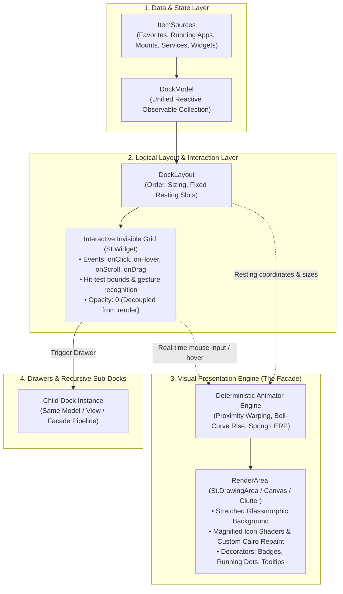
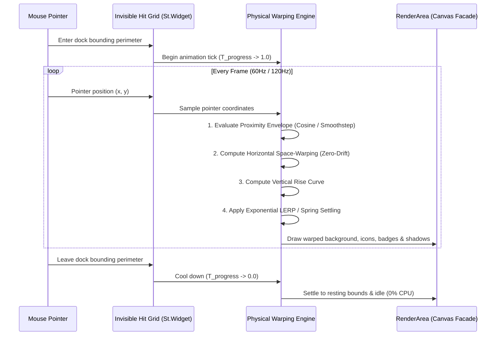

# The Ultimate Shell: Autonomous Dock & Desktop Architecture

> **Document:** `docs/DESIGN.md`  
> **Status:** Vision, Core Architecture & Technical Specification  
> **Evolution:** Transcending legacy Dash-to-Dock hacks to engineer an extensible, high-performance, modular desktop surface.

---

## 1. Vision & Philosophy

Modern desktop docks should not be tightly coupled hacks around GNOME Shell's internal `Dash.js`. They should be **first-class desktop UI systems**:
1. **Total Decoupling (Pure Pipeline):** The Data Model (`DockModel`) is completely decoupled from the Interactive Hit-Test Grid (`DockItemContainer`) and the Visual Presentation Layer (`RenderArea Facade`).
2. **Item-First Extensibility:** Apps, App Drawers, System Widgets (Clock, Calendar, Trash, Monitors, Audio, Volume), and Scriptable Indicators share the exact same unified interface: `DockItem`.
3. **Infinite Nesting & Morphing (Drawers as Docks):** A drawer or app folder is simply a dock item that can unfold or project as another child dock—vertically, horizontally, or radial fan-out.
4. **Deterministic Physical Animation:** Ultra-smooth 60/120Hz coordinate space warping, macOS-patent tier magnification, dynamic rises, and tactile spring physics with zero idle wakeups.

---

## 2. High-Level Architecture Overview



---

## 3. Core Component Model

### 3.1 The Universal `DockItem` Interface
Every entity on the dock implements a uniform protocol, whether it is an application icon, a system widget, or a folder drawer:

```typescript
interface DockItem {
  readonly id: string;
  readonly type: 'app' | 'widget' | 'drawer' | 'separator';
  
  // Presentation
  getIcon(): Gio.Icon | St.Icon | string;
  getLabel(): string;
  getBadge(): string | number | null;
  getIndicator(): IndicatorState; // none, active, running, minimized
  
  // Custom Rendering (Optional canvas/cairo override)
  hasCustomDraw(): boolean;
  onCustomDraw?(context: CairoContext, width: number, height: number): void;
  
  // Reactive Input & Actions
  onClick(button: number, modifiers: Clutter.ModifierType): void;
  onHover(entering: boolean): void;
  onScroll(direction: Clutter.ScrollDirection): void;
  
  // Context & Menus
  getMenu(): PopupMenu | null;
  
  // Drag & Drop
  isDraggable(): boolean;
  getDragPayload?(): any;
  onDrop?(payload: any): boolean;
  
  // Teardown
  destroy(): void;
}
```

### 3.2 Visual Structure of a `DockItem`
Each item rendered through the pipeline supports modular visual layers:
```
DockItem
  ├── Icon Graphic (GIcon, SVG, or Cairo dynamic drawing)
  ├── Hover State & Proximity Glow (Rise elevation, sheen)
  ├── Context Menu (Action options, window switcher, quick controls)
  ├── Custom Repaint Hook (Live clock face, live calendar date, CPU/RAM meter)
  ├── Count Indicator / Status Dot (Running, focused, multi-window count)
  └── Notification Badge (Count pill, urgent alert dot)
```

---

## 4. `DockModel` & `ItemSources`

Instead of relying on upstream Shell `Dash` internals, the dock is driven by an observable, reactive **`DockModel`**:

```
DockModel (Unified Collection)
  ├── Items: [ Favorites | Separator | Running | Drawers | Widgets ]
  └── Signals:
        ├── 'item-added' (index, item)
        ├── 'item-removed' (index, item)
        ├── 'item-moved' (oldIndex, newIndex)
        └── 'item-changed' (item)
```

### 4.1 Pluggable `ItemSources`
`ItemSources` feed model updates asynchronously through clean public system contracts:

1. **`FavoritesSource`**:
   - Backed by `AppFavorites.getAppFavorites()`.
   - Listens to `'changed'` signal; translates to model additions, removals, and moves.
2. **`RunningAppsSource`**:
   - Backed by `Shell.AppSystem` and `Shell.WindowTracker`.
   - Surfaces running applications not present in favorites.
   - Synchronizes running states, window lists, and active focus.
3. **`WidgetSource`**:
   - Modular registry for micro-widgets:
     - **Clock**: Live Cairo analog or digital clock face.
     - **Calendar**: Dynamic date badge with calendar popup.
     - **Trash**: Live file count, drop-to-trash, and empty trash Gio workflow.
     - **Mounted Volumes**: Auto-detected USB/network drives with unmount actions.
     - **System Monitor**: CPU, GPU, memory, or battery ring meter.
4. **`DrawerSource` (Icon Drawers & Quick Launchers)**:
   - Groups of applications or file folders.
   - Collapsed into a single badge item.

---

## 5. Icon Drawers: Recursive Sub-Docks

A primary limitation of traditional docks is rigid handling of folders and overflow. In the Ultimate Shell design:

### 5.1 Drawer Concepts
- **Inline Expand:** Clicking a drawer smoothly spreads adjacent dock items apart, unfolding child icons directly inline along the dock axis.
- **Fan-Out / Popup Sub-Dock:** Clicking a drawer spawns a child `Dock` instance anchored perpendicularly to the parent item:
  - Inherits the exact same magnification curve and visual glassmorphism.
  - Can host apps (e.g. "Games", "Utilities"), files (Downloads, Recent Files), or quick actions.
  - Dismisses gracefully on click-out, escape, or pointer departure.

```
       [ Sub-Dock Popup ]
       ┌─────────────────┐
       │ (A) (B) (C) (D) │
       └────────▲────────┘
                │
[ App1 ] [ App2 ] [ Drawer ] [ Trash ]
```

---

## 6. The Deterministic Physical Presentation Engine

The visual engine adopts the complete **Space-Warping Facade Architecture** outlined in `docs/ANIMATION.md`:



### 6.1 Presentation Guarantees
- **0% Idle CPU:** Zero polling, zero running timelines when the pointer is resting or outside the dock area.
- **Pure Proximity Magnification:** Zero artificial spread inflation; icons expand with true magnification preserving the active icon dead-center under the cursor.
- **Customizable Rise Geometry:** Linear proximity, cosine bell, or smoothstep polynomial vertical displacement.
- **Glassmorphic Canvas Background:** Dynamically rounded corner radiuses, gradient borders, and reactive blur without IPC thrashing.

---

## 7. Migration & Implementation Roadmap

```mermaid
gantt
    title Ultimate Shell Implementation Roadmap
    dateFormat  X
    axisFormat  Day %d

    section Foundation
    Define DockItem interface & base classes        :a1, 0, 2
    Implement reactive DockModel & signal bus        :a2, after a1, 3
    Build standalone App & Favorites ItemSources     :a3, after a2, 3

    section View & Facade
    Construct native St.BoxLayout Hit Grid           :b1, after a3, 3
    Integrate existing Animator & RenderArea         :b2, after b1, 4
    Port Context Menus & Show Apps                   :b3, after b2, 2

    section Modularity & Drawers
    Refactor Clock, Calendar, Trash to WidgetItems   :c1, after b3, 3
    Implement Icon Drawer & Sub-Dock popup           :c2, after c1, 4
    Quality Gates, Strict Leak Audit & Cutover       :c3, after c2, 3
```



1. **Step 1 — Core Interfaces & `DockModel`**:
   - Create `dockItem.js` defining `DockItem` and base classes.
   - Create `dockModel.js` managing items, sources, and signals.
2. **Step 2 — Standalone Native Grid**:
   - Create `dockGrid.js` (`St.BoxLayout`) holding responsive `DockItemContainer` actors.
   - Connect hit-testing directly to `Animator` without any `Dash.js` proxy.
3. **Step 3 — Port Existing Widgets**:
   - Migrate Clock, Calendar, Trash, Downloads, and Mounts into clean `DockItem` subclasses.
4. **Step 4 — Drawers & Sub-Docks**:
   - Implement folder drawers that unpack into child sub-docks.
5. **Step 5 — Complete Cutover**:
   - Purge `Dash.js` imports, private Shell monkeypatches, and obsolete proxy shims.
