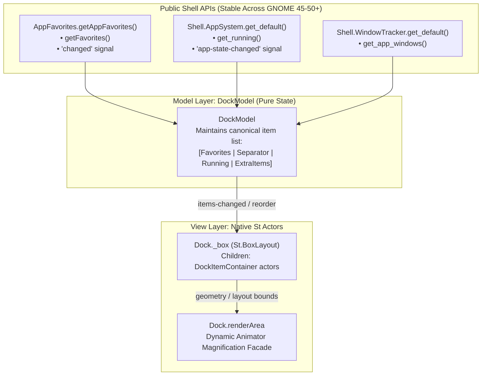

# DOCKMODEL — Proposal & Architectural Specification: Dropping Shell Dash.js Dependency

> **Status:** Proposal & Plan (Task R-16)  
> **Goal:** Eliminate GNOME Shell `ui/dash.js` (`new Dash()`) proxy dependency to achieve total GNOME-update resilience (Goal G3) and clean lifecycle management (Goal G1).

---

## 1. Executive Summary

Currently, each `Dock` instance instantiates GNOME Shell's own `Dash` (`new Dash()`, [`dock.js:452`](file:///home/iceman/Developer/gnome/dash2dock-lite/dock.js#L452)) and uses it as an invisible layout and data proxy. All icons within it have their opacity set to 0, while our `Animator` renders proxy `St.Icon`s ("renderers") into `dock.renderArea`.

While this historical hack provided initial support for favorites order, app launching, and drag-and-drop, it represents the **#1 source of version fragility across GNOME 45–50+** and forces invasive monkeypatches into private Shell APIs.

By replacing `new Dash()` with a standalone `DockModel` + `DockItem` structure fed by stable, public Shell APIs (`AppFavorites`, `Shell.AppSystem`, and `Shell.WindowTracker`), Dash2Dock Animated completely decouples from private upstream Dash internals while drastically simplifying lifecycle and layout.

---

## 2. What `Dash.js` Provides Today vs. What We Actually Use

| Capability | What `Dash.js` does | What Dash2Dock Animated actually needs | Replacement API / Strategy |
|---|---|---|---|
| **Favorites Order** | Maintains Shell favorites list | Ordered list of pinned app IDs | `AppFavorites.getAppFavorites().getFavorites()` + `'changed'` signal |
| **Running Apps** | AppSystem query & updates | List of running applications & window states | `Shell.AppSystem.get_default().get_running()` + `'app-state-changed'` |
| **App Activation** | `AppIcon.activate(button)` | Focus/raise, launch, minimize/maximize | Direct `app.activate()` / `app.open_new_window()` + WindowTracker |
| **Context Menu** | `AppIconMenu` | Right-click application menu (Quit, New Window, etc.) | Direct instantiation of `AppIconMenu(app)` or `PopupMenu` |
| **Show Apps** | `ShowAppsIcon` in Dash | Button to toggle application grid | Direct button calling `Main.overview.showApps()` |
| **Drag & Drop** | `DND.LauncherDraggable` | Reordering favorites & dropping apps to dock | Direct `AppFavorites.moveFavoriteToPos(id, index)` / Clutter DND |
| **Separators** | Dash separator actor | Separates favorites from non-favorite running apps | Lightweight native `St.Widget` separator |

---

## 3. Coupling & Bugs Eliminated

Dropping `Dash.js` completely eliminates the major coupling points tracked in [`agents/D2DA.md`](file:///home/iceman/Developer/gnome/dash2dock-lite/agents/D2DA.md):

- **C1 (Dash instantiation & monkeypatching):** Eliminates `_adjustIconSize = () => {}`, monkeypatching `_createAppItem`, and deep access to `_box`, `_dashContainer`, `_showAppsIcon`, and `_background`.
- **C2 (Deep actor hierarchy traversal):** Eliminates inspecting nested paths across GNOME 45–50 (`child.icon.icon`, `_iconBin.child`, `icon.icon`, `_dot`, `label`, `_draggable`).
- **C3 (Per-instance monkeypatching):** Eliminates patching `c._appwell.activate` and `c.showLabel`.
- **C4 (Overview Dash state hacking):** Eliminates hacking `Main.overview.dash` and expando hacks.
- **B-1 / B-40 (Lifecycle leaks):** Upstream `Dash` attaches listeners to `AppSystem`, `AppFavorites`, and the overview that can outlive extension teardown if not carefully tracked. With `DockModel`, all signals are connected using `connectObject(this)` and cleaned up symmetrically via `disconnectObject(this)`.

---

## 4. Architectural Design

### 4.1 Data Model (`DockModel`)
`DockModel` is a pure GObject or EventEmitter that synchronizes with:
1. `AppFavorites.getAppFavorites()`:
   - On `'changed'`: queries `getFavorites()`, updates the favorites partition.
2. `Shell.AppSystem.get_default()`:
   - On `'app-state-changed'`: queries `get_running()`, updates running apps partition.
3. User Settings:
   - Respects `favorites_only` filter cleanly without hacking actor visibility.
4. Extra Icons:
   - Manages Trash, Downloads, and Mounts as first-class model entities alongside apps.

### 4.2 View Layer (`DockItemContainer` & `St.BoxLayout`)
- Replace `this.dash` with a clean `St.BoxLayout` (`this._box`).
- Each item is a lightweight container hosting an icon texture, dot, badge, and label.
- Direct input handling on items (`button-press-event` / `clicked`):
  - Primary click: Activates application or cycles windows.
  - Middle click: Launches new instance.
  - Secondary click: Pops context menu (`AppIconMenu`).

---

## 5. Phased Implementation & Migration Plan

### Phase 1: Prototype `dockModel.js`
- Implement `DockModel` emitting `changed` events.
- Unit-test model ordering, favorite toggling, and running-app tracking in a standalone test (`tests/dock_model_check.js`).

### Phase 2: Dual-Backend in `dock.js`
- Introduce a setting or runtime toggle (`this.use_native_model = true`).
- Allow running side-by-side with the existing Dash proxy implementation for validation.

### Phase 3: Quality Gate Verification
- Run headless smoke tests (`make smoke`, `D2DA_SMOKE_STRICT_LEAKS=1 tools/smoke-shell.sh 5`).
- Confirm zero error signatures, zero GC criticals, and strict leak-free lifecycle.

### Phase 4: Deprecate and Remove `Dash.js`
- Cut over completely to `DockModel`.
- Remove `Dash` import and proxy helper functions from [`dock.js`](file:///home/iceman/Developer/gnome/dash2dock-lite/dock.js) and [`compat.js`](file:///home/iceman/Developer/gnome/dash2dock-lite/compat.js).
